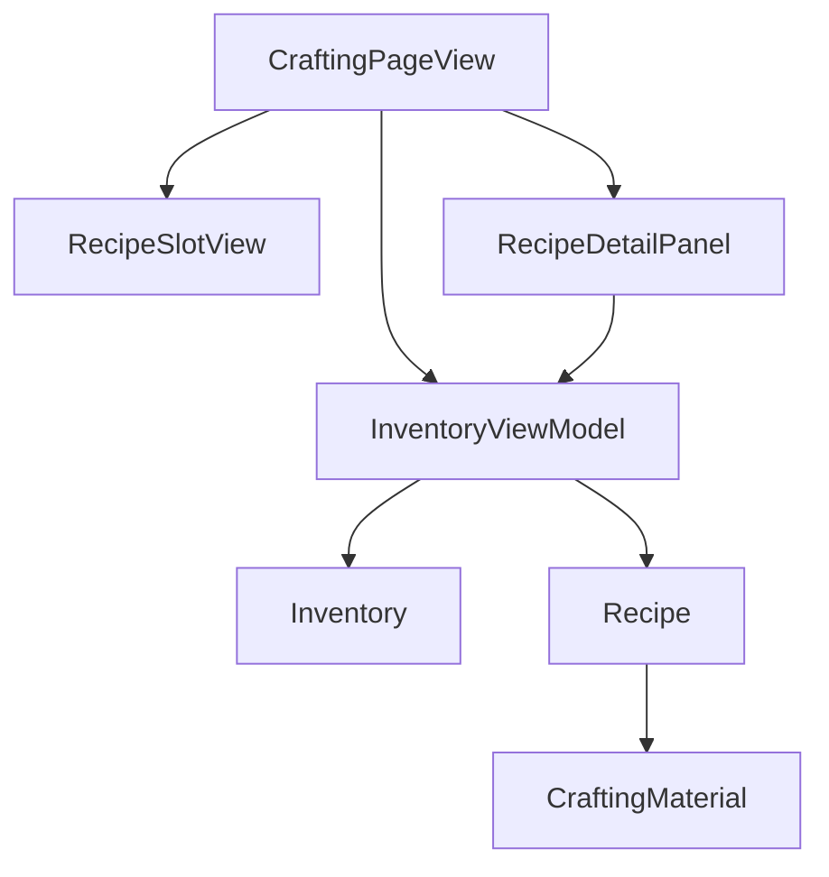
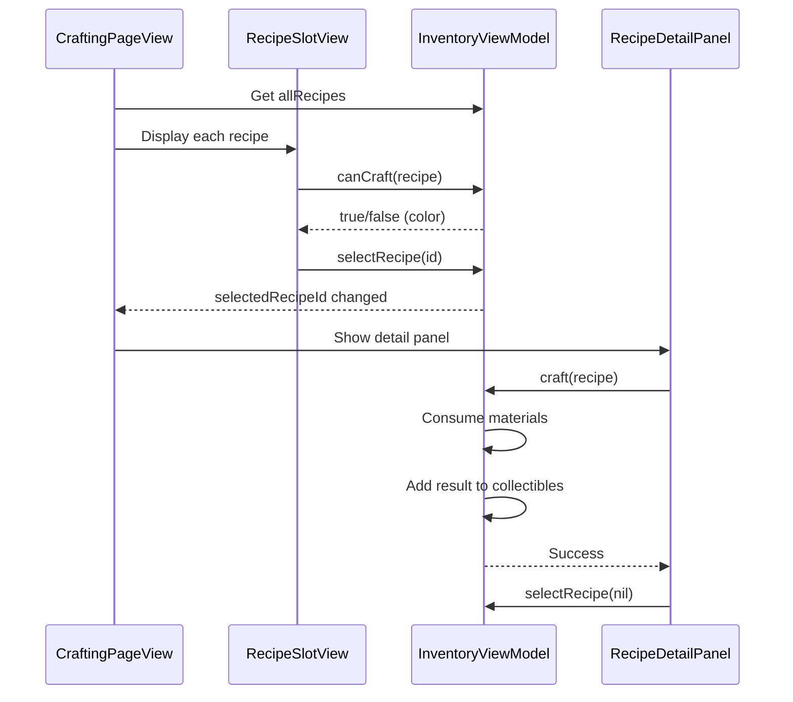

# Crafting System - Design

## Overview
The crafting system extends the existing inventory UI with a new page that displays recipes in a grid format. It reuses existing patterns from CollectiblesPageView and InventorySlotView while adding crafting-specific logic for material checking and item creation.

## Tech Stack
- SwiftUI (existing)
- MVVM architecture (existing pattern)
- No new dependencies

## Architecture Diagram



## Component Design

### New Files

#### Recipe.swift
- **Type**: Model
- **Purpose**: Defines recipe data structure and static recipe catalog
- **Dependencies**: SlotContent, ResourceType from existing models
- **Key Properties**:
  - `id: String` - Unique recipe identifier
  - `name: String` - Display name
  - `result: SlotContent` - The item produced
  - `materials: [CraftingMaterial]` - Required materials
- **Key Methods**:
  - `static var allRecipes: [Recipe]` - Returns all available recipes

#### CraftingMaterial.swift
- **Type**: Model
- **Purpose**: Defines a material requirement (resource type + quantity)
- **Dependencies**: ResourceType
- **Key Properties**:
  - `resource: ResourceType` - The required resource
  - `quantity: Int` - Amount needed

#### RecipeSlotView.swift
- **Type**: View
- **Purpose**: Displays a single recipe in the grid with craftability color
- **Dependencies**: Recipe, InventoryViewModel
- **Key Properties**:
  - `recipe: Recipe` - The recipe to display
  - `isCraftable: Bool` - Computed from inventory
  - `isSelected: Bool` - Selection state
- **Visual**: 44x44 slot with green/red border based on craftability

#### RecipeDetailPanel.swift
- **Type**: View
- **Purpose**: Shows recipe details and craft button when a recipe is selected
- **Dependencies**: Recipe, InventoryViewModel
- **Key Elements**:
  - Recipe name and icon
  - List of materials with have/need quantities
  - Craft button (green when craftable, gray when not)
  - Close button

#### CraftingPageView.swift (modify existing)
- **Type**: View
- **Purpose**: Main crafting page with recipe grid
- **Changes**: Replace placeholder with full implementation
- **Key Elements**:
  - Header with "Crafting" title
  - 5x6 LazyVGrid of RecipeSlotView
  - RecipeDetailPanel overlay when recipe selected

### Modified Files

#### InventoryViewModel.swift
- **Changes**: Add crafting-related methods
- **New Properties**:
  - `selectedRecipeId: String?` - Currently selected recipe
- **New Methods**:
  - `canCraft(_ recipe: Recipe) -> Bool` - Checks if all materials available
  - `craft(_ recipe: Recipe) -> Bool` - Executes craft, consumes materials
  - `materialCount(for: ResourceType) -> Int` - Gets current inventory count
  - `selectRecipe(_ id: String?)` - Selects/deselects recipe
  - `hasEmptySlotForCraft(_ recipe: Recipe) -> Bool` - Checks if result can be stored

## Data Flow



## Data Models

### Recipe
```swift
struct Recipe: Identifiable {
    let id: String
    let name: String
    let result: SlotContent
    let materials: [CraftingMaterial]

    static var allRecipes: [Recipe] { ... }
}
```

### CraftingMaterial
```swift
struct CraftingMaterial {
    let resource: ResourceType
    let quantity: Int
}
```

### Sample Recipes
```swift
// Basic Meal: 2 Fish + 1 Seaweed
Recipe(
    id: "basic_meal",
    name: "Basic Meal",
    result: .meal(type: .basicMeal, healAmount: 2, tempHearts: 0),
    materials: [
        CraftingMaterial(resource: .commonFish, quantity: 2),
        CraftingMaterial(resource: .seaweed, quantity: 1)
    ]
)

// Heart Meal: 1 Rare Fish + 2 Seaweed
Recipe(
    id: "heart_meal",
    name: "Heart Meal",
    result: .meal(type: .heartMeal, healAmount: 3, tempHearts: 0),
    materials: [
        CraftingMaterial(resource: .rareFish, quantity: 1),
        CraftingMaterial(resource: .seaweed, quantity: 2)
    ]
)
```

## State Management

| State | Type | Location | Purpose |
|-------|------|----------|---------|
| `selectedRecipeId` | `@Published String?` | InventoryViewModel | Tracks selected recipe |
| `inventory` | `@Published Inventory` | InventoryViewModel | Source of truth for materials |
| Recipe list | Static | Recipe.allRecipes | Immutable recipe catalog |

## Error Handling

| Scenario | Handling |
|----------|----------|
| Inventory full | Disable craft button, show "Inventory Full" text |
| Not enough materials | Disable craft button (gray), show red text on missing materials |
| Craft succeeds | Close panel, update grid colors |

## Performance Considerations
- Recipe list is static, no database queries
- Craftability computed on-demand using existing inventory data
- Grid uses LazyVGrid for efficient rendering
- Material counts cached per render cycle

## Accessibility
- All slots meet 44x44pt minimum touch target
- Color is not sole indicator (icons always present)
- VoiceOver labels for recipe names and craftability

## Testing Strategy

### Unit Tests
- `canCraft()` returns true when all materials present
- `canCraft()` returns false when any material missing
- `craft()` consumes correct material quantities
- `craft()` adds result to collectibles
- `materialCount()` correctly sums stacked resources

### UI Tests
- Tapping recipe shows detail panel
- Craft button disabled when not craftable
- Craft button enabled when craftable
- Crafting closes panel and updates grid
