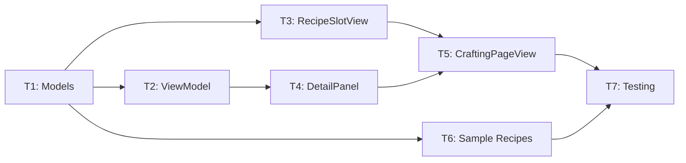

# Crafting System - Implementation Tasks

## Task Overview

| ID | Task | Dependencies | Estimate |
|----|------|--------------|----------|
| T1 | Create Recipe and CraftingMaterial models | None | S |
| T2 | Add crafting methods to InventoryViewModel | T1 | M |
| T3 | Create RecipeSlotView | T1 | S |
| T4 | Create RecipeDetailPanel | T1, T2 | M |
| T5 | Implement CraftingPageView | T2, T3, T4 | M |
| T6 | Add sample recipes | T1 | S |
| T7 | Integration testing | T5, T6 | S |

## Detailed Tasks

### T1: Create Recipe and CraftingMaterial Models
- **Priority**: Must
- **Dependencies**: None
- **Requirements Addressed**: FR-8

**Actions**:
1. Create `driftwood/Models/Recipe.swift`
2. Define `CraftingMaterial` struct with `resource: ResourceType` and `quantity: Int`
3. Define `Recipe` struct with `id`, `name`, `result: SlotContent`, `materials: [CraftingMaterial]`
4. Add computed property for result icon and display name
5. Add `static var allRecipes: [Recipe]` placeholder (empty array)

**Acceptance Criteria**:
- [ ] CraftingMaterial struct compiles
- [ ] Recipe struct compiles with Identifiable conformance
- [ ] Recipe.allRecipes returns empty array

---

### T2: Add Crafting Methods to InventoryViewModel
- **Priority**: Must
- **Dependencies**: T1
- **Requirements Addressed**: FR-2, FR-5, FR-6, FR-7

**Actions**:
1. Add `@Published var selectedRecipeId: String?` property
2. Add `selectRecipe(_ id: String?)` method
3. Add `materialCount(for resource: ResourceType) -> Int` method
   - Iterate collectibles, sum quantities for matching resource type
4. Add `canCraft(_ recipe: Recipe) -> Bool` method
   - Check all materials have sufficient quantity
   - Check hasEmptySlotForCraft or result is stackable
5. Add `hasEmptySlotForCraft(_ recipe: Recipe) -> Bool` method
   - Meals: check meal slots
   - Resources: check resource slots or existing stack
6. Add `craft(_ recipe: Recipe) -> Bool` method
   - Verify canCraft first
   - Consume materials using decrementStack
   - Add result using addItem
   - Clear selectedRecipeId
   - Return success

**Acceptance Criteria**:
- [ ] materialCount correctly sums stacked resources
- [ ] canCraft returns true only when all materials available
- [ ] canCraft returns false when inventory full for result type
- [ ] craft consumes materials and adds result
- [ ] craft returns false if cannot craft

---

### T3: Create RecipeSlotView
- **Priority**: Must
- **Dependencies**: T1
- **Requirements Addressed**: FR-1, FR-2

**Actions**:
1. Create `driftwood/Views/Inventory/RecipeSlotView.swift`
2. Accept `recipe: Recipe`, `isCraftable: Bool`, `isSelected: Bool`, `onTap: () -> Void`
3. Use 44x44 frame size matching InventorySlotView
4. Display recipe result icon (handle custom images)
5. Show green border when craftable, red when not
6. Show yellow selection border when selected

**Acceptance Criteria**:
- [ ] Slot displays recipe icon correctly
- [ ] Green border when isCraftable is true
- [ ] Red border when isCraftable is false
- [ ] Yellow border overlay when selected
- [ ] 44x44 touch target

---

### T4: Create RecipeDetailPanel
- **Priority**: Must
- **Dependencies**: T1, T2
- **Requirements Addressed**: FR-3, FR-4, FR-5, FR-6, FR-7

**Actions**:
1. Create `driftwood/Views/Inventory/RecipeDetailPanel.swift`
2. Accept `recipe: Recipe`, `viewModel: InventoryViewModel`, `onClose: () -> Void`, `onCraft: () -> Void`
3. Display recipe name and large icon at top
4. List each material with:
   - Resource icon (custom or SF Symbol)
   - Resource name
   - "X / Y" format (have / need)
   - Green text if have >= need, red if have < need
5. Add Craft button at bottom:
   - Green background and tappable when canCraft
   - Gray background and disabled when cannot craft
   - Show "Inventory Full" text if that's the blocker
6. Add close button (X) in corner

**Acceptance Criteria**:
- [ ] Panel shows recipe name and icon
- [ ] All materials listed with quantities
- [ ] Material text colored by availability
- [ ] Craft button state matches craftability
- [ ] Close button dismisses panel
- [ ] Craft button triggers onCraft callback

---

### T5: Implement CraftingPageView
- **Priority**: Must
- **Dependencies**: T2, T3, T4
- **Requirements Addressed**: FR-1, FR-3

**Actions**:
1. Update existing `CraftingPageView.swift`
2. Add header row with "Crafting" title (match CollectiblesPageView style)
3. Create 5-column LazyVGrid with 44pt fixed width, 6pt spacing
4. Display RecipeSlotView for each recipe in Recipe.allRecipes
5. Pass craftability from `viewModel.canCraft(recipe)`
6. Handle selection: tap sets `viewModel.selectedRecipeId`
7. Show RecipeDetailPanel overlay when recipe selected
8. Wire up craft action to `viewModel.craft(recipe)`

**Acceptance Criteria**:
- [ ] 5x6 grid layout matches collectibles
- [ ] Each recipe shows with correct craftability color
- [ ] Tapping recipe shows detail panel
- [ ] Tapping same recipe closes panel
- [ ] Crafting works and updates UI

---

### T6: Add Sample Recipes
- **Priority**: Must
- **Dependencies**: T1
- **Requirements Addressed**: FR-8

**Actions**:
1. Update `Recipe.allRecipes` with initial recipes:
   - Basic Meal: 2 Fish + 1 Seaweed
   - Heart Meal: 1 Rare Fish + 2 Seaweed
   - Stamina Meal: 2 Seaweed + 1 Scale
2. Ensure recipes use existing ResourceType values
3. Ensure results use existing MealType values

**Acceptance Criteria**:
- [ ] At least 3 recipes defined
- [ ] Recipes use valid resource types
- [ ] Results are valid SlotContent

---

### T7: Integration Testing
- **Priority**: Should
- **Dependencies**: T5, T6
- **Requirements Addressed**: All

**Actions**:
1. Build and run in simulator
2. Verify crafting tab appears in inventory
3. Test with empty inventory (all red)
4. Add fish via fishing, verify recipes turn green
5. Craft a meal, verify:
   - Materials consumed
   - Meal appears in collectibles meal slot
   - Recipe updates color if now uncraftable
6. Test inventory full scenario

**Acceptance Criteria**:
- [ ] No build errors
- [ ] Crafting UI matches collectibles style
- [ ] Full craft flow works end-to-end
- [ ] Edge cases handled (empty, full inventory)

## Implementation Order

## File Checklist

### New Files
- [ ] `driftwood/Models/Recipe.swift`
- [ ] `driftwood/Views/Inventory/RecipeSlotView.swift`
- [ ] `driftwood/Views/Inventory/RecipeDetailPanel.swift`

### Modified Files
- [ ] `driftwood/ViewModels/InventoryViewModel.swift`
- [ ] `driftwood/Views/Inventory/CraftingPageView.swift`
