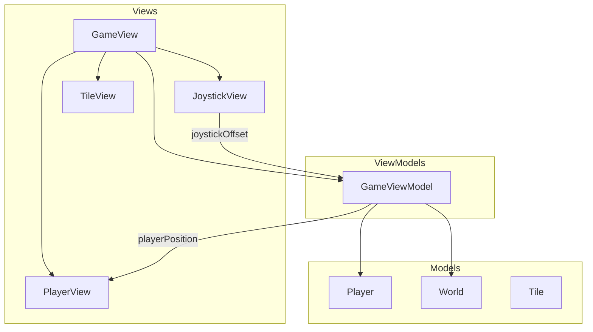
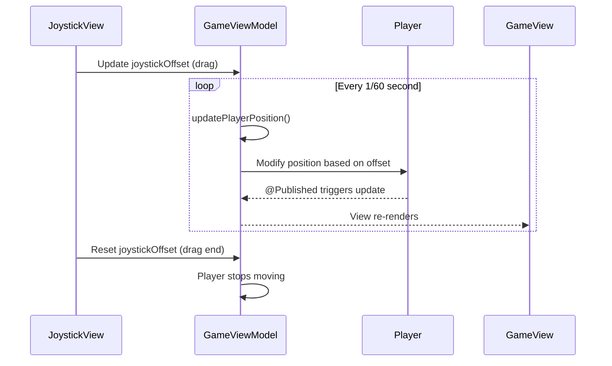

# Player Movement System - Design

## Overview
Add a player character with joystick-based free movement to the existing tile-based world. The architecture follows MVVM pattern with a GameViewModel managing player state and a Timer-based game loop for smooth movement updates.

## Tech Stack
- SwiftUI (existing)
- Combine (Timer publisher for game loop)
- No external dependencies

## Architecture Diagram



## Component Design

### New Files

#### Models/Player.swift
- **Type**: Model
- **Purpose**: Store player position and size
- **Dependencies**: Foundation, CoreGraphics
- **Properties**:
  - `position: CGPoint` - Current world position in points
  - `size: CGFloat` - Player diameter (12pt = half tile)
- **Key Methods**:
  - `init(startPosition:)` - Initialize at spawn point

#### ViewModels/GameViewModel.swift
- **Type**: ViewModel (ObservableObject)
- **Purpose**: Manage game state, player movement, game loop
- **Dependencies**: Combine, Player, World
- **Properties**:
  - `@Published player: Player`
  - `@Published world: World`
  - `joystickOffset: CGSize` - Current joystick displacement
  - `movementSpeed: CGFloat` - Base movement speed multiplier
- **Key Methods**:
  - `startGameLoop()` - Begin Timer-based position updates
  - `stopGameLoop()` - Stop movement updates
  - `updatePlayerPosition()` - Called each frame, moves player based on joystick

#### Views/JoystickView.swift
- **Type**: View
- **Purpose**: Render and handle joystick touch input
- **Dependencies**: SwiftUI
- **Properties**:
  - `@Binding offset: CGSize` - Bound to GameViewModel.joystickOffset
  - `baseSize: CGFloat` - Outer ring diameter (120pt)
  - `thumbSize: CGFloat` - Inner knob diameter (50pt)
- **Key Methods**:
  - `clampOffset(_:)` - Constrain thumb within base radius

#### Views/PlayerView.swift
- **Type**: View
- **Purpose**: Render player as red circle
- **Dependencies**: SwiftUI
- **Properties**:
  - `size: CGFloat` - Player diameter
- **Notes**: Simple Circle with .fill(Color.red)

### Modified Files

#### Views/GameView.swift
- **Changes**:
  - Replace `@State private var world` with `@StateObject private var viewModel`
  - Add ZStack to layer world, player, and joystick
  - Add .onAppear to start game loop
  - Add .onDisappear to stop game loop
- **Reason**: Integrate player rendering and joystick controls

#### driftwoodApp.swift
- **Changes**:
  - Add AppDelegate to enforce landscape orientation programmatically
- **Reason**: FR-6 landscape lock (backup to Info.plist)

#### Info.plist (or project settings)
- **Changes**:
  - Set UISupportedInterfaceOrientations to landscape only
- **Reason**: FR-6 landscape orientation lock

## Data Flow



## Data Models

### Player
```swift
struct Player {
    var position: CGPoint
    let size: CGFloat = 12 // half of 24pt tile

    init(startPosition: CGPoint) {
        self.position = startPosition
    }
}
```

### Joystick Offset
```swift
// Using CGSize for joystick offset
// width = x displacement, height = y displacement
// Normalized: values from -1.0 to 1.0 based on max radius
```

## State Management
- `@StateObject var viewModel: GameViewModel` in GameView (owns the state)
- `@Published var player: Player` in GameViewModel (triggers view updates)
- `@Binding var offset: CGSize` in JoystickView (two-way binding to viewModel)
- Timer subscription stored in GameViewModel for game loop

## Error Handling
- No network calls, minimal error scenarios
- Guard against invalid positions (negative coords)
- Joystick offset clamping prevents out-of-bounds values

## Security Considerations
- No sensitive data
- No network communication
- No user authentication

## Performance Considerations
- Timer at 60fps (1/60 second interval) for smooth movement
- Minimal computation per frame (just position += offset * speed)
- Player position change triggers only player view re-render
- World grid is static, no re-render on player movement

## Accessibility
- Joystick requires touch interaction (no alternative input for now)
- Player color (red) has good contrast on grass (green) and ocean (blue)
- Future: Consider adding haptic feedback on movement

## Testing Strategy

### Unit Tests
- Player initial position is correct
- Player position updates correctly given offset
- Joystick offset clamping works at boundary

### UI Tests
- Joystick appears on screen
- Player appears on screen
- Dragging joystick moves player
- Releasing joystick stops player

## File Structure
```
driftwood/
├── Models/
│   ├── Player.swift (new)
│   ├── Tile.swift
│   └── World.swift
├── ViewModels/
│   └── GameViewModel.swift (new)
├── Views/
│   ├── GameView.swift (modified)
│   ├── JoystickView.swift (new)
│   └── PlayerView.swift (new)
├── ContentView.swift
└── driftwoodApp.swift (modified)
```
