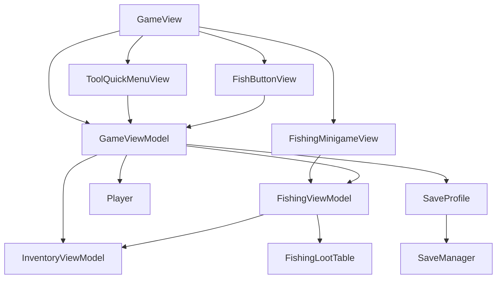
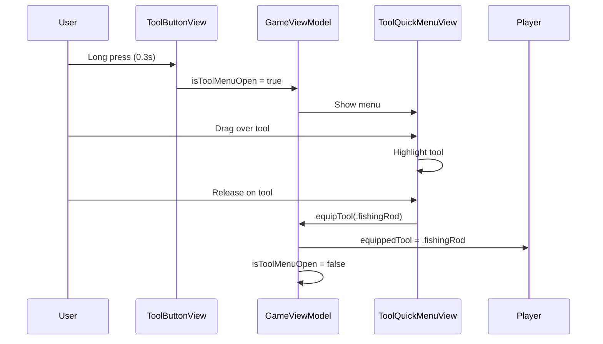
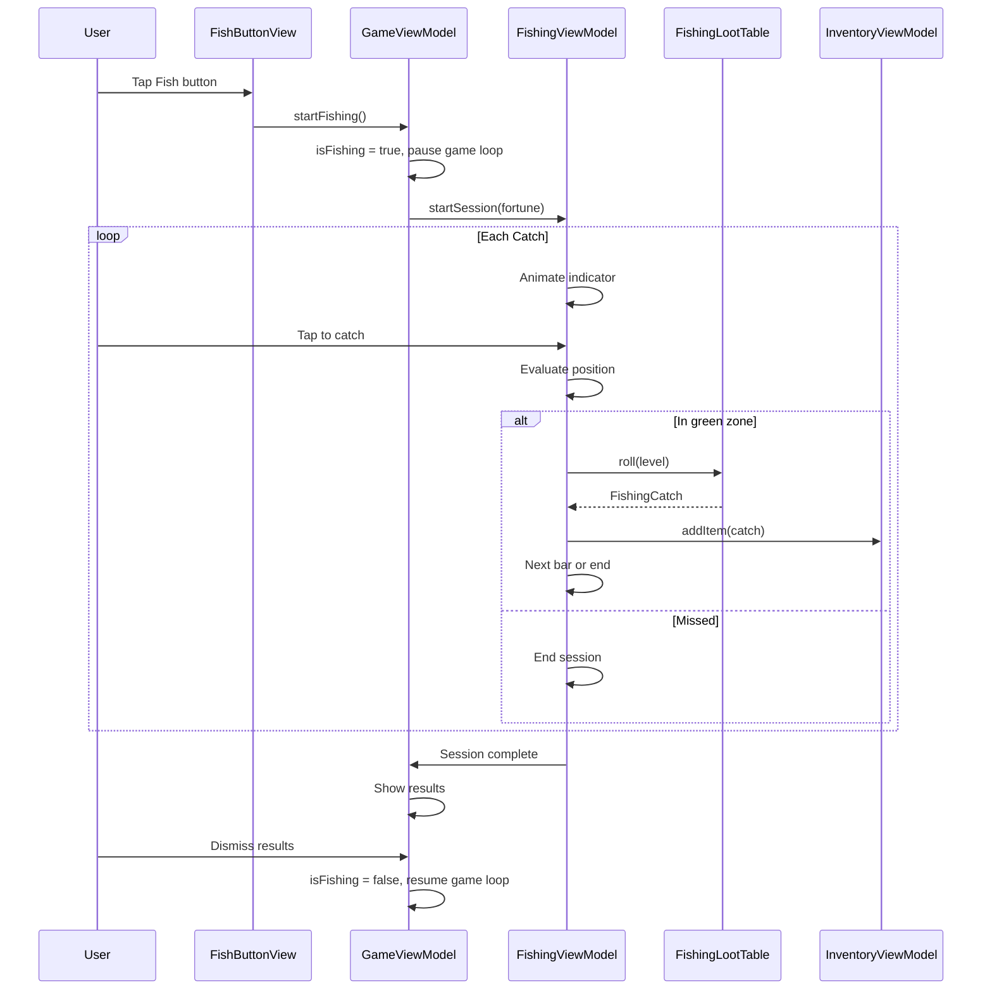

# Fishing System - Design

## Overview

The fishing system adds a core gameplay loop with tool selection, proximity-based interactions, and a timing minigame. Following existing MVVM patterns, we add new views for the tool menu and fishing minigame, extend GameViewModel for game state, and create a FishingViewModel for minigame logic.

## Tech Stack

- SwiftUI (existing)
- Combine for timers (existing pattern from GameViewModel)
- No new dependencies

## Architecture Diagram



## Component Design

### New Files

#### Models/FishingState.swift
- **Type**: Model
- **Purpose**: Tracks fishing level, total catches, and session state
- **Dependencies**: None
- **Key Properties**:
  - `fishingLevel: Int` (1-10)
  - `totalCatches: Int`
  - `levelThresholds: [Int]` (static)

#### Models/FishingLootTable.swift
- **Type**: Model
- **Purpose**: Defines loot tables per level, handles loot rolls
- **Dependencies**: ItemType enums, CollectibleSlot
- **Key Methods**:
  - `roll(level: Int) -> FishingCatch` - random loot based on level
  - `getLootTable(level: Int) -> [(item: LootItem, chance: Double)]`

#### ViewModels/FishingViewModel.swift
- **Type**: ViewModel
- **Purpose**: Manages fishing minigame state and logic
- **Dependencies**: FishingLootTable, InventoryViewModel, FishingState
- **Key Properties**:
  - `indicatorPosition: CGFloat` (0-1, animated)
  - `greenZoneStart: CGFloat`, `greenZoneWidth: CGFloat`
  - `perfectZoneStart: CGFloat`, `perfectZoneWidth: CGFloat`
  - `remainingCatches: Int`
  - `sessionCatches: [FishingCatch]`
  - `comboCount: Int`
  - `isActive: Bool`
- **Key Methods**:
  - `startSession(fortune: Int)` - initialize minigame
  - `attemptCatch() -> CatchResult` - evaluate tap timing
  - `endSession()` - finalize and return results

#### Views/Fishing/ToolQuickMenuView.swift
- **Type**: View
- **Purpose**: Hold-drag tool selection overlay
- **Dependencies**: GameViewModel (for tool inventory, equip action)
- **Key Features**:
  - Horizontal row of tool icons
  - Drag tracking for hover highlight
  - Release detection for selection

#### Views/Fishing/ToolButtonView.swift
- **Type**: View
- **Purpose**: HUD button that activates tool menu on long press
- **Dependencies**: GameViewModel
- **Key Features**:
  - Shows equipped tool icon (or default)
  - Long press gesture (0.3s) to open menu

#### Views/Fishing/FishButtonView.swift
- **Type**: View
- **Purpose**: Context-sensitive "Fish" action button
- **Dependencies**: GameViewModel (visibility conditions)
- **Key Features**:
  - Only visible when canFish is true
  - Tapping starts fishing minigame

#### Views/Fishing/FishingMinigameView.swift
- **Type**: View
- **Purpose**: Full-screen fishing minigame overlay
- **Dependencies**: FishingViewModel
- **Key Features**:
  - Timing bar with indicator
  - Green zone and perfect zone
  - Tap anywhere to attempt catch

#### Views/Fishing/FishingResultsView.swift
- **Type**: View
- **Purpose**: Shows caught items after session ends
- **Dependencies**: FishingViewModel (session results)
- **Key Features**:
  - Grid of caught items
  - "Inventory Full" indicators for lost items
  - Dismiss button

### Modified Files

#### Models/Player.swift
- **Changes**: Add `equippedTool: ToolType?` property
- **Reason**: Track currently equipped tool for HUD and fishing checks

#### Models/SaveProfile.swift
- **Changes**:
  - Add `fishingLevel: Int` (default 1)
  - Add `totalCatches: Int` (default 0)
  - Add `equippedTool: ToolType?` (default nil)
- **Reason**: Persist fishing progress and equipped tool

#### Models/Inventory.swift
- **Changes**: Modify `Inventory.empty()` to set `fishingRodTier = 1`
- **Reason**: FR-1 starter fishing rod requirement

#### ViewModels/GameViewModel.swift
- **Changes**:
  - Add `@Published var fishingViewModel: FishingViewModel?`
  - Add `@Published var isToolMenuOpen: Bool`
  - Add `@Published var isFishing: Bool`
  - Add `equippedTool: ToolType?` (synced with player)
  - Add `isNearWater() -> Bool` method
  - Add `canFish: Bool` computed property
  - Add `equipTool(_ tool: ToolType?)` method
  - Add `startFishing()` / `endFishing()` methods
- **Reason**: Orchestrate tool menu and fishing minigame state

#### Views/GameView.swift
- **Changes**:
  - Add ToolButtonView to controlsLayer
  - Add FishButtonView (conditional on canFish)
  - Add ToolQuickMenuView overlay (conditional on isToolMenuOpen)
  - Add FishingMinigameView overlay (conditional on isFishing)
- **Reason**: Integrate new UI components

## Data Flow

### Tool Selection Flow



### Fishing Minigame Flow



## Data Models

### FishingState
```swift
struct FishingState: Codable {
    var fishingLevel: Int = 1
    var totalCatches: Int = 0

    static let levelThresholds = [0, 10, 25, 50, 100, 250, 500, 1000, 2500, 5000]

    mutating func addCatch() {
        totalCatches += 1
        updateLevel()
    }

    private mutating func updateLevel() {
        for (level, threshold) in Self.levelThresholds.enumerated() {
            if totalCatches >= threshold && level + 1 > fishingLevel {
                fishingLevel = min(level + 1, 10)
            }
        }
    }
}
```

### FishingCatch
```swift
struct FishingCatch {
    let item: SlotContent
    var addedToInventory: Bool = false
}
```

### CatchResult
```swift
enum CatchResult {
    case miss
    case success(item: FishingCatch)
    case perfect(item: FishingCatch)
}
```

### LootItem (for loot table)
```swift
enum LootItem {
    case resource(ResourceType)
    case oldSetPiece
    case mossySetPiece
    case treasureChest
    // etc.

    func toSlotContent() -> SlotContent { ... }
}
```

## State Management

| State | Type | Location | Purpose |
|-------|------|----------|---------|
| `equippedTool` | `ToolType?` | Player, SaveProfile | Currently equipped tool |
| `isToolMenuOpen` | `@Published Bool` | GameViewModel | Tool menu visibility |
| `isFishing` | `@Published Bool` | GameViewModel | Minigame active state |
| `fishingLevel` | `Int` | SaveProfile | Persistent level (1-10) |
| `totalCatches` | `Int` | SaveProfile | Persistent catch count |
| `indicatorPosition` | `@Published CGFloat` | FishingViewModel | Animated 0-1 position |
| `sessionCatches` | `[FishingCatch]` | FishingViewModel | Current session results |
| `comboCount` | `Int` | FishingViewModel | Perfect catch streak |

## Error Handling

- **Inventory full**: Catch is marked `addedToInventory = false`, shown in results
- **No tools owned**: Tool menu shows empty state, cannot equip
- **Invalid tool state**: Guard against nil equipped tool in canFish check

## Performance Considerations

- Indicator animation uses Timer at 60fps (same pattern as game loop)
- Loot table lookup is O(n) where n is number of items at level (max ~20)
- Tool menu icons cached (system SF Symbols)

## Accessibility

- Tool icons use SF Symbols with accessibility labels
- Fish button has clear accessibility label
- Minigame could benefit from haptic feedback on catch zones (future)

## Testing Strategy

### Unit Tests
- `FishingLootTable.roll()` returns valid items for each level
- `FishingState.addCatch()` correctly levels up at thresholds
- `FishingViewModel.attemptCatch()` correctly evaluates positions

### Integration Tests
- Tool equip persists through save/load cycle
- Fishing session adds items to inventory correctly
- Fishing level persists across sessions
