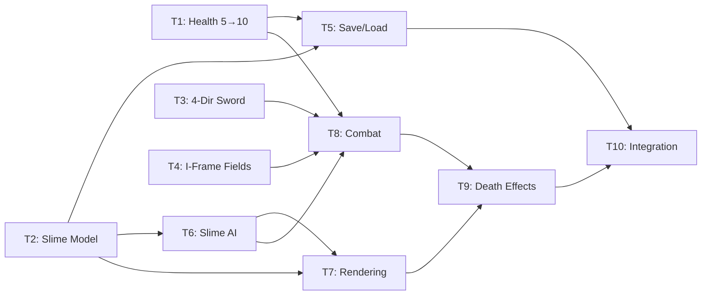

# Enemy Slime System - Implementation Tasks

## Summary
- Total tasks: 10
- Estimated complexity: Medium

## Task Dependency Graph

## Tasks

### Task 1: Health System Migration (5→10)
- **Status**: Completed
- **Dependencies**: None
- **Files**:
  - Modify: `driftwood/Models/Player.swift`
  - Modify: `driftwood/Models/SaveProfile.swift`
  - Modify: `driftwood/Services/SaveManager.swift`
  - Modify: `driftwood/Views/GameView.swift` (HeartsView)
- **Requirements Addressed**: FR-6 (foundation), FR-17 (migration)
- **Description**:
  Double the internal health representation so 1 unit = half heart. This enables half-heart damage from slime contact without using floats.
- **Implementation Notes**:
  - Player.swift: Change `health: Int = 5` → `10`, `maxHealth: Int = 5` → `10`
  - SaveProfile.swift: Update `empty(id:)` to use `health: 10`
  - SaveManager.swift: Add `migrateHealthScale()` — if profile health ≤ 5, double it. Call in `loadProfiles()` pipeline
  - HeartsView: Loop `0..<(maxHealth / 2)`. For each index, compute `heartHealth = health - index * 2`. Display `heart.fill` if ≥ 2, `heart.lefthalf.fill` if == 1, `heart` if ≤ 0
  - Update `effectiveMaxHealth` in GameViewModel — bonusHearts should also be doubled (or bonus is already in half-heart units)
  - Check all places that modify `player.health` (drowning damage `health - 1` → `health - 2`, meal healing, respawn) and adjust to new scale
  - The `handleStaminaDepleted` drowning check `health <= 1` needs updating to `health <= 2` (1 full heart)
- **Acceptance Criteria**:
  - [ ] Player health internally stored as 10 (5 hearts)
  - [ ] HeartsView displays 5 full hearts at health 10
  - [ ] HeartsView displays 4.5 hearts at health 9 (half-heart icon)
  - [ ] Old saves with health ≤ 5 are migrated to doubled values
  - [ ] Drowning still costs 1 full heart (2 HP) and kills at ≤ 1 full heart (≤ 2 HP)
  - [ ] Respawn restores to effectiveMaxHealth (10 + bonuses)
  - [ ] Build succeeds

### Task 2: Slime Model + Save Data + Default Spawns
- **Status**: Completed
- **Dependencies**: None
- **Files**:
  - Create: `driftwood/Models/Slime.swift`
  - Modify: `driftwood/Models/World.swift`
- **Requirements Addressed**: FR-1, FR-2
- **Description**:
  Create the Slime data model with all fields needed for AI, combat, and rendering. Add SlimeSaveData as a Codable subset. Add default spawn positions on North Island.
- **Implementation Notes**:
  - Slime.swift: Define `SlimeAIState` enum (patrol/chase/returning), `Slime` struct (Identifiable), `SlimeSaveData` struct (Codable), `SlimeDeathEffect` struct
  - Slime uses `id: Int` (0, 1, 2) — stable across saves
  - Include all constants from design: size=24, halfSize=12, patrolSpeed=40, chaseSpeed=65, patrolRadius=120, chaseRadius=192, knockbackDistance=40, contactDamage=1, hitFlashDuration=0.15
  - `collisionRect` computed property using position and halfSize
  - `toSaveData()` method on Slime that creates SlimeSaveData
  - World.swift: Add `static func defaultSlimeSpawns() -> [Slime]` with 3 fixed grass tile positions on North Island
  - Spawn positions: Pick 3 grass tiles spread across North Island (avoid edges, teleport pad, and rocks)
  - Convert tile coords to pixel coords: `CGFloat(tileX) * 24 + 12` (center of tile)
- **Acceptance Criteria**:
  - [ ] Slime struct has all required fields (id, position, spawnOrigin, health, isAlive, aiState, etc.)
  - [ ] SlimeSaveData is Codable with id, position, health, isAlive
  - [ ] SlimeDeathEffect struct has id, position, elapsed, duration
  - [ ] `World.defaultSlimeSpawns()` returns exactly 3 slimes on North Island grass tiles
  - [ ] All spawn positions are deterministic
  - [ ] Build succeeds

### Task 3: 4-Directional Sword Swing
- **Status**: Completed
- **Dependencies**: None
- **Files**:
  - Modify: `driftwood/Models/Player.swift` (FacingDirection)
  - Modify: `driftwood/Views/PlayerView.swift`
- **Requirements Addressed**: FR-9, FR-20
- **Description**:
  Enable sword swing animations for all 4 directions by reusing the existing SwordSwingUp sprites with programmatic transforms.
- **Implementation Notes**:
  - Player.swift FacingDirection: `attackSpriteName(frame:)` should return `"SwordSwingUp\(frame)"` for ALL directions (the visual flipping is handled in the view)
  - PlayerView.swift: When `isAttacking`, apply transforms based on `facingDirection`:
    - `.up`: No transform (existing behavior)
    - `.down`: Apply `.scaleEffect(x: 1, y: -1)` to flip vertically
    - `.left`: Apply `.scaleEffect(x: -1, y: 1)` to mirror horizontally
    - `.right`: No transform (sprite already faces right-ish when up sprites used as-is — OR apply identity. Test and pick what looks best)
  - Note: The transforms flip the entire player sprite during attack. This may look odd — if so, consider using rotation instead: `.rotationEffect(.degrees(angle))`
  - Alternative simpler approach: Just return the SwordSwingUp sprite for all directions and only apply the hitbox directionally (visual can be refined later)
- **Acceptance Criteria**:
  - [ ] Sword swing works when facing up (existing behavior preserved)
  - [ ] Sword swing plays animation when facing down
  - [ ] Sword swing plays animation when facing left
  - [ ] Sword swing plays animation when facing right
  - [ ] Animation timing is 12 frames at 30ms each for all directions
  - [ ] Build succeeds

### Task 4: Player Combat Fields (I-Frames + Swing Tracking)
- **Status**: Completed
- **Dependencies**: None
- **Files**:
  - Modify: `driftwood/Models/Player.swift`
- **Requirements Addressed**: FR-7 (foundation), FR-10 (foundation)
- **Description**:
  Add invincibility timer and attack swing ID fields to the Player struct. These are used by the combat system but don't depend on it existing yet.
- **Implementation Notes**:
  - Add `var invincibilityTimer: CGFloat = 0`
  - Add `var isInvincible: Bool { invincibilityTimer > 0 }` computed property
  - Add `static let invincibilityDuration: CGFloat = 0.5`
  - Add `var attackSwingId: Int = 0` — incremented each time `startSwordSwing()` is called
- **Acceptance Criteria**:
  - [ ] `invincibilityTimer`, `isInvincible`, `invincibilityDuration` exist on Player
  - [ ] `attackSwingId` exists on Player, defaults to 0
  - [ ] Build succeeds

### Task 5: Slime Save/Load Persistence
- **Status**: Completed
- **Dependencies**: Task 1, Task 2
- **Files**:
  - Modify: `driftwood/Models/SaveProfile.swift`
  - Modify: `driftwood/ViewModels/GameViewModel.swift`
- **Requirements Addressed**: FR-15, FR-16, FR-17, FR-18
- **Description**:
  Add slime data to the save system. SaveProfile gets an optional slimes field for backwards compatibility. GameViewModel loads slimes from save or generates defaults, and includes slime data when saving.
- **Implementation Notes**:
  - SaveProfile.swift: Add `var slimes: [SlimeSaveData]?` (optional — nil means use defaults, enables migration)
  - Update `empty(id:)`: set `slimes: nil`
  - Update `init(from player:...)`: add `slimes: [SlimeSaveData]?` parameter
  - Update `init(id:...)`: add `slimes` parameter with default nil
  - GameViewModel.swift: Add `@Published var slimes: [Slime] = []`
  - In `init(profile:)`: if `profile.slimes != nil`, restore from save data; else use `World.defaultSlimeSpawns()`
  - In `createSaveProfile()`: map `slimes.map { $0.toSaveData() }` and pass to SaveProfile
  - Slime restore: For each SlimeSaveData, create Slime with saved id/position/health/isAlive and spawnOrigin from default spawns
  - Player death/respawn does NOT touch slimes — already handled by default (respawn() doesn't modify slimes array)
- **Acceptance Criteria**:
  - [ ] SaveProfile has optional `slimes` field
  - [ ] Old saves without slimes field decode without error (nil)
  - [ ] New/empty profiles generate default slime spawns on first load
  - [ ] Slime position and health persist across save/load
  - [ ] Dead slimes stay dead after save/load
  - [ ] Slimes unaffected by player death/respawn
  - [ ] Build succeeds

### Task 6: Slime AI (Patrol, Chase, Return)
- **Status**: Completed
- **Dependencies**: Task 2
- **Files**:
  - Modify: `driftwood/ViewModels/GameViewModel.swift`
- **Requirements Addressed**: FR-3, FR-4, FR-5, FR-21
- **Description**:
  Implement the slime AI state machine in GameViewModel. Slimes patrol near their spawn, chase the player when within 8 tiles, and return home when the player leaves range. Includes tile collision for slime movement.
- **Implementation Notes**:
  - Add `updateSlimes(deltaTime:)` method, called from `updatePlayerPosition()`
  - Add `slimeCanMoveTo(_:) -> Bool` — same pattern as `canMoveTo()` but with slime halfSize (12x12 square hitbox)
  - **Patrol logic**: If `patrolPauseTimer > 0`, decrement and wait. Else move toward patrol target at `patrolSpeed`. If within 2px of target or target unreachable, pause 1-2s and pick new random target within `patrolRadius` of `spawnOrigin`
  - **Random target**: Generate random angle + random distance (0...patrolRadius), convert to position, clamp to walkable tiles
  - **Chase detection**: Each frame, compute Euclidean distance to player. If ≤ `chaseRadius` and currently patrolling/returning, switch to `.chase`
  - **Chase logic**: Move directly toward `player.position` at `chaseSpeed`. Use normalized direction vector
  - **Return logic**: If chasing and distance > `chaseRadius`, switch to `.returning`. Move toward `spawnOrigin` at `patrolSpeed`. When within 24px (1 tile), switch to `.patrol(target: spawnOrigin)`
  - **Movement**: Calculate `deltaX/deltaY`, test new position with `slimeCanMoveTo()`, apply if valid. Use slide movement (try X only, then Y only) if direct fails
  - Only update alive slimes
  - Wire `updateSlimes(deltaTime:)` into `updatePlayerPosition()` after attack animation update
- **Acceptance Criteria**:
  - [ ] Slimes wander within 5 tiles of spawn at ~40 px/s
  - [ ] Slimes pause 1-2s between patrol waypoints
  - [ ] Slimes chase player within 8-tile detection range at ~65 px/s
  - [ ] Slimes stop chasing and return when player exits 8-tile range
  - [ ] Slimes smoothly return to spawn area and resume patrol
  - [ ] Slimes cannot walk on ocean, rock, or non-walkable tiles
  - [ ] Dead slimes are skipped
  - [ ] Build succeeds

### Task 7: Slime Rendering + Depth Sorting
- **Status**: Completed
- **Dependencies**: Task 2, Task 6
- **Files**:
  - Create: `driftwood/Views/SlimeView.swift`
  - Modify: `driftwood/Views/GameView.swift`
- **Requirements Addressed**: FR-14, FR-19, NFR-3
- **Description**:
  Create SlimeView with bounce animation and hit flash. Add slime rendering to GameView with depth sorting relative to the player.
- **Implementation Notes**:
  - SlimeView.swift: Takes screen position, hitFlashTimer. Renders a green filled circle (or placeholder rectangle) at 24x24px with `.interpolation(.none)`. Bounce animation: apply `scaleEffect(x: 1, y: bounceScale)` where `bounceScale = 1.0 + 0.15 * sin(phase)`. Phase increments based on a timer. For hit flash: overlay white with opacity when `hitFlashTimer > 0`
  - Until a real sprite asset exists, use a simple green circle/ellipse as placeholder
  - GameView.swift: Split slimes into two groups by depth:
    - `behindSlimes`: slime bottomY (position.y + halfSize) < player bottomY (position.y + size/2)
    - `frontSlimes`: the rest
  - Render `behindSlimes` layer after non-overlapping overlays, before player
  - Render `frontSlimes` layer after player, before overlapping overlays
  - Each slime positioned with same camera math: `screenX = screenWidth/2 + (slime.position.x - cameraX)`
  - Add `@State private var bounceTimer: CGFloat = 0` or use `TimelineView` for animation timing
  - Add `updateHitFlash(deltaTime:)` in GameViewModel to decrement hitFlashTimer on each slime
- **Acceptance Criteria**:
  - [ ] Alive slimes render at correct world positions
  - [ ] Dead slimes are not rendered
  - [ ] Slimes behind player render behind; slimes in front render in front
  - [ ] Slime has continuous bounce animation (squish/stretch cycle)
  - [ ] Hit flash shows white overlay briefly when slime takes damage
  - [ ] Pixel-art rendering (no smoothing)
  - [ ] Build succeeds

### Task 8: Combat System (Contact Damage + Sword Hits + Knockback)
- **Status**: Completed
- **Dependencies**: Task 1, Task 2, Task 3, Task 4, Task 6
- **Files**:
  - Modify: `driftwood/ViewModels/GameViewModel.swift`
- **Requirements Addressed**: FR-6, FR-7, FR-8, FR-9, FR-10, FR-11, FR-12
- **Description**:
  Implement the full combat loop: slimes deal contact damage to the player (with i-frames and knockback), and the sword damages slimes (with knockback). Wire into the game loop.
- **Implementation Notes**:
  - **Invincibility timer update**: In `updateAttackAnimation(deltaTime:)` (or new method), decrement `player.invincibilityTimer` by deltaTime, clamp to 0
  - **Contact damage** (`checkSlimeContactDamage()`): For each alive slime, compute player hitbox (24x32 centered on position) and slime collisionRect. If they intersect AND `!player.isInvincible`:
    - Deal `Slime.contactDamage` (1 unit = half heart) to player.health
    - Set `player.invincibilityTimer = Player.invincibilityDuration`
    - Apply knockback to player: direction = player.position - slime.position, normalized, distance ~40px
    - If health ≤ 0: trigger death (set `isDead = true`, save)
  - **Sword hits** (`checkSwordHits()`): If `player.isAttacking`, compute `swordHitbox()`. For each alive slime, if hitbox intersects slime.collisionRect AND `slime.hitCooldown != player.attackSwingId`:
    - Deal 1 HP damage to slime
    - Set `slime.hitCooldown = player.attackSwingId`
    - Set `slime.hitFlashTimer = Slime.hitFlashDuration`
    - Apply knockback to slime: direction based on player facingDirection, distance ~40px
    - If slime.health ≤ 0: set `slime.isAlive = false`, spawn death effect
  - **Sword hitbox**: `swordHitbox() -> CGRect?` — based on facing direction, place 28x28 hitbox 20px in front of player center
  - **Knockback**: `applyPlayerKnockback(direction:)` and `applySlimeKnockback(slimeIndex:direction:)` — use stepped movement (4 steps of 10px) with collision checking
  - **canEntityMoveTo(_:halfWidth:halfHeight:)** — generic collision check reusable for both player and slime knockback
  - In `startSwordSwing()`: increment `player.attackSwingId`
  - Wire `checkSlimeContactDamage()` and `checkSwordHits()` into `updatePlayerPosition()` after `updateSlimes()`
  - Death from slime contact: store death position, show death screen. Use similar pattern to drowning death but without fade animation (immediate)
- **Acceptance Criteria**:
  - [ ] Player takes half-heart damage on slime contact
  - [ ] Player is invincible for 0.5s after taking damage
  - [ ] Player is knocked back ~40px away from slime on contact
  - [ ] Knockback stops at walls/rocks (not pushed into ocean)
  - [ ] Sword hitbox appears in correct direction (up/down/left/right)
  - [ ] Sword hitbox only active during swing animation
  - [ ] Each swing can only hit a given slime once
  - [ ] Slime takes 1 HP per sword hit (dies in 2 hits)
  - [ ] Slime is knocked back ~40px in player's facing direction on sword hit
  - [ ] Player can die from slime damage (death screen appears)
  - [ ] Build succeeds

### Task 9: Death Effects + I-Frame Visual
- **Status**: Completed
- **Dependencies**: Task 7, Task 8
- **Files**:
  - Create: `driftwood/Views/SlimeDeathEffectView.swift`
  - Modify: `driftwood/ViewModels/GameViewModel.swift`
  - Modify: `driftwood/Views/GameView.swift`
- **Requirements Addressed**: FR-13, FR-7 (visual blink)
- **Description**:
  Add the slime death pop + particle effect and the player i-frame blink visual.
- **Implementation Notes**:
  - **SlimeDeathEffectView.swift**: Takes screen position and elapsed time. Shows:
    - Central green circle that scales from 1.0 → 1.5 then fades
    - 4-6 small green circles that scatter outward (random angles, ~20-30px distance) and fade
    - Total animation ~0.4 seconds
    - Use `elapsed / duration` as animation progress
  - **GameViewModel.swift**: Add `@Published var deathEffects: [SlimeDeathEffect] = []`. When slime dies in `checkSwordHits()`, append `SlimeDeathEffect(position: slime.position)`. Add `updateDeathEffects(deltaTime:)` — increment elapsed, remove when elapsed > duration. Call from `updatePlayerPosition()`
  - **GameView.swift i-frame blink**: On PlayerView, apply `.opacity(viewModel.player.isInvincible ? (Int(viewModel.player.invincibilityTimer * 10) % 2 == 0 ? 0.3 : 1.0) : 1.0)` — toggles opacity every ~0.1s
  - **GameView.swift death effects**: Add a ZStack layer (above slimes, below HUD) that renders each active death effect with camera-relative positioning
- **Acceptance Criteria**:
  - [ ] Slime death triggers pop + particle effect at slime position
  - [ ] Particles scatter outward and fade over ~0.4s
  - [ ] Death effect cleans up after animation completes
  - [ ] Player sprite blinks/flashes during i-frames
  - [ ] Blink toggles every ~0.1s for visual clarity
  - [ ] Blink stops when invincibility expires
  - [ ] Build succeeds

### Task 10: Integration Build + Verification
- **Status**: Completed
- **Dependencies**: Task 5, Task 9
- **Files**:
  - Modify: `driftwood/ViewModels/GameViewModel.swift` (if needed)
  - Modify: `driftwood/Views/GameView.swift` (if needed)
- **Requirements Addressed**: FR-18, NFR-1, NFR-2
- **Description**:
  Final integration pass. Verify all systems work together: slimes spawn, patrol, chase, take damage, die permanently, persist across saves, and don't reset on player death. Build and run on iPhone 16e simulator.
- **Implementation Notes**:
  - Verify game loop order in `updatePlayerPosition()`:
    1. `updateAttackAnimation(deltaTime:)` — includes i-frame timer decrement
    2. `updateStamina(deltaTime:, isMoving:)`
    3. `updateSlimes(deltaTime:)` — AI movement
    4. `checkSlimeContactDamage()` — contact → player damage
    5. `checkSwordHits()` — sword → slime damage
    6. `updateDeathEffects(deltaTime:)` — particle cleanup
    7. Player movement (existing)
  - Verify slimes are added to Xcode project target
  - Run build: `xcodebuild -project driftwood.xcodeproj -scheme driftwood -destination 'platform=iOS Simulator,name=iPhone 16e' build`
  - Test scenarios:
    - New game: 3 slimes on North Island
    - Patrol: slimes wander near spawn
    - Chase: walk within 8 tiles, slimes follow
    - Contact damage: touch slime, lose half heart, get knocked back, blink
    - Sword kill: 2 hits to kill, knockback on each hit, death effect plays
    - Save/load: quit and reload, slimes in same state
    - Player death: die to slime, respawn, slimes unchanged
    - Old save: load pre-slime save, slimes spawn at defaults
- **Acceptance Criteria**:
  - [ ] Build succeeds on iPhone 16e simulator
  - [ ] No crashes during gameplay
  - [ ] All 10 test scenarios pass
  - [ ] 60 FPS maintained with 3 slimes active
  - [ ] No regressions in existing features (fishing, sailing, inventory)

## Implementation Order

1. **Task 1** — Health 5→10 migration (foundation for half-heart damage)
2. **Task 2** — Slime model + default spawns (foundation for everything slime)
3. **Task 3** — 4-directional sword swing (independent, needed for combat)
4. **Task 4** — Player i-frame + swing fields (quick, independent)
5. **Task 5** — Save/load persistence (needs T1 + T2)
6. **Task 6** — Slime AI (needs T2, makes slimes move)
7. **Task 7** — Slime rendering (needs T2 + T6, makes slimes visible)
8. **Task 8** — Combat system (needs T1-T4 + T6, core gameplay)
9. **Task 9** — Death effects + i-frame visual (polish layer)
10. **Task 10** — Integration build + verification

Tasks 1-4 can be done in parallel. Tasks 5-6 can be done in parallel after their deps. Task 7 can start once T6 is done.

## Integration Checklist
- [ ] All 10 tasks completed
- [ ] Build succeeds (xcodebuild)
- [ ] Game runs on iPhone 16e simulator
- [ ] Slimes visible and moving on North Island
- [ ] Sword kills slimes in 2 hits from all 4 directions
- [ ] Contact damage deals half hearts with i-frame blink
- [ ] Knockback works both directions
- [ ] Death effect particles play on slime kill
- [ ] Save/load preserves slime state
- [ ] Old saves migrate without error
- [ ] Player death doesn't reset slimes
- [ ] No regressions in fishing, sailing, inventory, teleport
