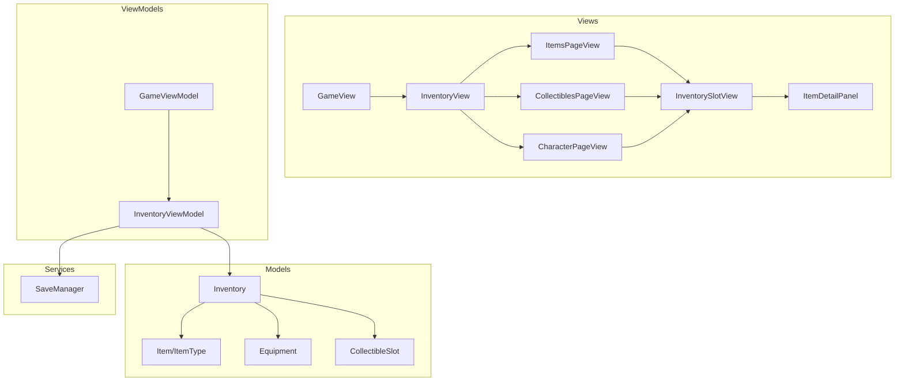
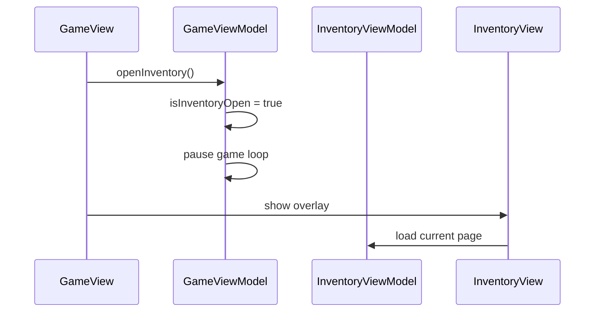
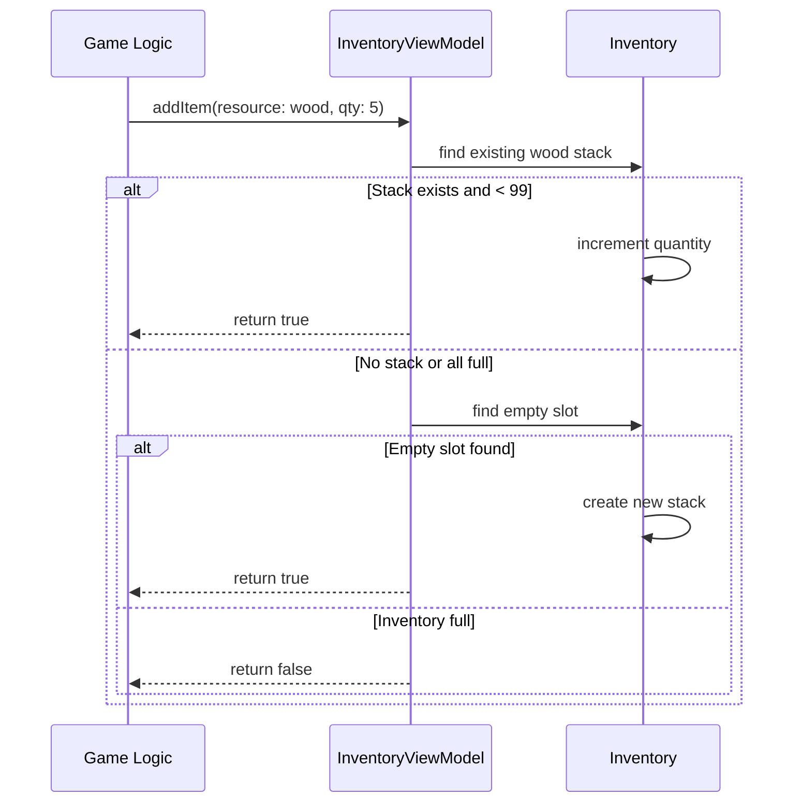
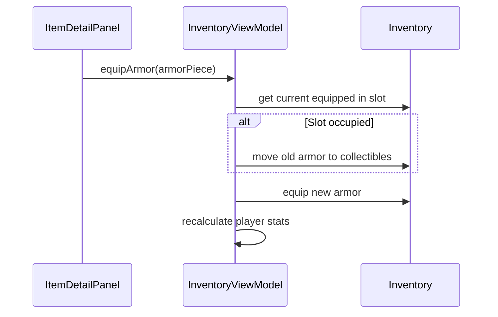

# Inventory System - Design

## Overview

A 3-page inventory system following MVVM architecture. The inventory is presented as a modal overlay that pauses gameplay. Data models support gear, tools, collectibles, equipment, and accessories with stacking, sorting, favorites, and junk tagging. Inventory data persists through the existing SaveProfile/SaveManager system.

## Tech Stack

- SwiftUI (existing)
- Combine (existing - for state observation)
- Foundation/Codable (persistence)
- No external dependencies

## Architecture Diagram



## Component Design

### New Files

#### Models/Inventory.swift
- **Type**: Model (Codable)
- **Purpose**: Root container for all inventory data
- **Dependencies**: Foundation
- **Properties**:
  ```swift
  struct Inventory: Codable {
      var gear: GearInventory
      var tools: ToolInventory
      var collectibles: [CollectibleSlot] // 30 slots
      var equipment: EquipmentSlots
      var accessories: AccessorySlots
      var majorUpgrades: MajorUpgrades
  }
  ```

#### Models/ItemType.swift
- **Type**: Model (Enum)
- **Purpose**: Define all item types in the game
- **Key Enums**:
  ```swift
  enum GearType: String, Codable, CaseIterable {
      case sails, motor, pouch
  }

  enum ToolType: String, Codable, CaseIterable {
      case fishingRod, sword, axe, wand
  }

  enum ResourceType: String, Codable, CaseIterable {
      case wood, metalScrap, cloth, oil
      // fish types
      case commonFish, rareFish, rainbowFish
  }

  enum FoodIngredientType: String, Codable, CaseIterable {
      case apple, carrot, mushroom, herb
  }

  enum MealType: String, Codable, CaseIterable {
      case basicMeal, heartMeal, staminaMeal
  }

  enum ArmorSlot: String, Codable, CaseIterable {
      case hat, shirt, pants, boots
  }

  enum AccessorySlot: String, Codable, CaseIterable {
      case anklet, ring, chain, bracelet
  }
  ```

#### Models/CollectibleSlot.swift
- **Type**: Model (Codable)
- **Purpose**: Represent a single inventory slot that can hold stackable/non-stackable items
- **Properties**:
  ```swift
  struct CollectibleSlot: Codable, Identifiable {
      let id: UUID
      var content: SlotContent?
      var isFavorite: Bool
      var isJunk: Bool
  }

  enum SlotContent: Codable {
      case resource(type: ResourceType, quantity: Int)
      case foodIngredient(type: FoodIngredientType)
      case meal(type: MealType)
  }
  ```

#### Models/Equipment.swift
- **Type**: Model (Codable)
- **Purpose**: Track equipped armor, accessories, and their stats
- **Properties**:
  ```swift
  struct ArmorPiece: Codable, Identifiable {
      let id: UUID
      let slot: ArmorSlot
      let setType: ArmorSetType
      var stats: ArmorStats
  }

  enum ArmorSetType: String, Codable {
      case old, mossy, magic, melee, movement
  }

  struct ArmorStats: Codable {
      var bonusHearts: CGFloat
      var fishingFortune: Int
      var defense: Int
      var magicRegen: CGFloat
      var movementSpeed: CGFloat
  }

  struct Accessory: Codable, Identifiable {
      let id: UUID
      let slot: AccessorySlot
      var tier: Int // 1-5
  }
  ```

#### ViewModels/InventoryViewModel.swift
- **Type**: ViewModel (ObservableObject)
- **Purpose**: Manage inventory state and operations
- **Dependencies**: SwiftUI, Inventory models
- **Properties**:
  - `@Published var inventory: Inventory`
  - `@Published var currentPage: InventoryPage`
  - `@Published var selectedSlot: Int?`
  - `@Published var sortMode: SortMode`
- **Key Methods**:
  - `addItem(_ item: SlotContent) -> Bool`
  - `removeItem(at index: Int)`
  - `equipArmor(_ armor: ArmorPiece)`
  - `equipAccessory(_ accessory: Accessory)`
  - `useMeal(at index: Int)`
  - `toggleFavorite(at index: Int)`
  - `toggleJunk(at index: Int)`
  - `sortCollectibles(by mode: SortMode)`

#### Views/InventoryView.swift
- **Type**: View
- **Purpose**: Main inventory overlay container with page tabs
- **Dependencies**: SwiftUI, InventoryViewModel
- **Subviews**:
  - Page tabs (Items, Collectibles, Character)
  - Close button
  - Current page content
- **Notes**: Full-screen overlay with semi-transparent background

#### Views/ItemsPageView.swift
- **Type**: View
- **Purpose**: Display Page 1 - Gear and Tools
- **Layout**:
  - Gear section header + 3 gear slots (Sails, Motor, Pouch)
  - Tools section header + 4 tool slots (Fishing Rod, Sword, Axe, Wand)
  - Each shows icon, name, tier indicator

#### Views/CollectiblesPageView.swift
- **Type**: View
- **Purpose**: Display Page 2 - 5x6 grid of collectible slots
- **Layout**:
  - Sort button in top-right
  - 5x6 grid (LazyVGrid)
  - Top row (5 slots) styled for meals
  - Bottom 25 slots for resources
- **Notes**: Slot size 44x44 for touch targets

#### Views/CharacterPageView.swift
- **Type**: View
- **Purpose**: Display Page 3 - Equipment and upgrades
- **Layout**:
  - Armor section: 4 labeled slots (Hat, Shirt, Pants, Boots)
  - Accessories section: 4 labeled slots (Anklet, Ring, Chain, Bracelet)
  - Major Upgrades section: 4 icons (Sailboat, Flippers, Wings, Pegasus Boots)
  - Stats summary panel

#### Views/InventorySlotView.swift
- **Type**: View
- **Purpose**: Render a single inventory slot with item icon, quantity, and indicators
- **Properties**:
  - `slot: CollectibleSlot`
  - `isSelected: Bool`
  - `onTap: () -> Void`
- **Visual Elements**:
  - Item icon (SF Symbol or custom)
  - Stack count badge (bottom-right)
  - Favorite star (top-left)
  - Junk indicator (top-right)
  - Selection highlight

#### Views/ItemDetailPanel.swift
- **Type**: View
- **Purpose**: Show item details and action buttons when slot selected
- **Properties**:
  - `item: SlotContent`
  - `onUse: (() -> Void)?`
  - `onEquip: (() -> Void)?`
  - `onFavorite: () -> Void`
  - `onJunk: () -> Void`
  - `onDrop: () -> Void`
  - `onClose: () -> Void`
- **Layout**:
  - Item name and icon
  - Description text
  - Stats (if applicable)
  - Action buttons row

#### Views/InventoryButton.swift
- **Type**: View
- **Purpose**: HUD button to open inventory
- **Notes**: Positioned bottom-right, uses backpack SF Symbol

### Modified Files

#### Models/SaveProfile.swift
- **Changes**:
  - Add `var inventory: Inventory`
  - Update `empty(id:)` to include default inventory
  - Update `init(from player:, id:)` to copy inventory
- **Reason**: FR-15 requires inventory persistence

#### ViewModels/GameViewModel.swift
- **Changes**:
  - Add `@Published var inventoryViewModel: InventoryViewModel`
  - Add `@Published var isInventoryOpen: Bool = false`
  - Update `createSaveProfile()` to include inventory
  - Add `openInventory()` / `closeInventory()`
  - Pause game loop while inventory open
- **Reason**: Inventory integration with game flow

#### Views/GameView.swift
- **Changes**:
  - Add InventoryButton to controlsLayer
  - Add InventoryView overlay when `isInventoryOpen`
- **Reason**: FR-1 inventory access from HUD

## Data Flow

### Opening Inventory


### Adding Item to Inventory


### Equipping Armor


## Data Models

### Inventory Structure
```swift
struct Inventory: Codable {
    var gear: GearInventory
    var tools: ToolInventory
    var collectibles: [CollectibleSlot]
    var equipment: EquipmentSlots
    var accessories: AccessorySlots
    var majorUpgrades: MajorUpgrades

    static func empty() -> Inventory {
        Inventory(
            gear: GearInventory(),
            tools: ToolInventory(),
            collectibles: (0..<30).map { _ in CollectibleSlot() },
            equipment: EquipmentSlots(),
            accessories: AccessorySlots(),
            majorUpgrades: MajorUpgrades()
        )
    }
}

struct GearInventory: Codable {
    var sailsTier: Int = 0 // 0-4
    var hasMotor: Bool = false
    var pouchTier: Int = 0 // 0-3
}

struct ToolInventory: Codable {
    var fishingRodTier: Int = 0 // 0-4
    var swordTier: Int = 0 // 0-3
    var axeTier: Int = 0 // 0-3
    var hasWand: Bool = false
}

struct EquipmentSlots: Codable {
    var hat: ArmorPiece?
    var shirt: ArmorPiece?
    var pants: ArmorPiece?
    var boots: ArmorPiece?
}

struct AccessorySlots: Codable {
    var anklet: Accessory?
    var ring: Accessory?
    var chain: Accessory?
    var bracelet: Accessory?
}

struct MajorUpgrades: Codable {
    var hasSailboat: Bool = false
    var hasFlippers: Bool = false
    var hasWings: Bool = false
    var hasPegasusBoots: Bool = false
}
```

### Collectible Slot
```swift
struct CollectibleSlot: Codable, Identifiable {
    let id: UUID
    var content: SlotContent?
    var isFavorite: Bool = false
    var isJunk: Bool = false
    var addedAt: Date = Date()

    init() {
        self.id = UUID()
        self.content = nil
    }

    var isEmpty: Bool { content == nil }
    var isMealSlot: Bool // computed based on slot index (0-4)
}

enum SlotContent: Codable {
    case resource(type: ResourceType, quantity: Int)
    case foodIngredient(type: FoodIngredientType)
    case meal(type: MealType, healAmount: Int, tempHearts: Int)
    case armor(piece: ArmorPiece)
    case accessory(item: Accessory)
}
```

## State Management

- `@StateObject var inventoryViewModel: InventoryViewModel` in GameViewModel
- `@Published var isInventoryOpen: Bool` in GameViewModel
- `@Published var currentPage: InventoryPage` in InventoryViewModel
- `@Published var selectedSlot: Int?` in InventoryViewModel
- `@Published var sortMode: SortMode` in InventoryViewModel

### InventoryPage Enum
```swift
enum InventoryPage: Int, CaseIterable {
    case items = 0
    case collectibles = 1
    case character = 2

    var title: String {
        switch self {
        case .items: return "Items"
        case .collectibles: return "Collectibles"
        case .character: return "Character"
        }
    }
}
```

### SortMode Enum
```swift
enum SortMode: String, CaseIterable {
    case type
    case rarity
    case recent
}
```

## Error Handling

- **Full inventory**: `addItem()` returns false, caller shows "Inventory Full" message
- **Invalid meal slot**: Prevent placing non-meals in top row programmatically
- **Equip with no space**: Check for empty slot before allowing equip, show warning
- **Corrupted data**: Inventory decoding failure resets to `Inventory.empty()`

## Performance Considerations

- Collectibles grid uses `LazyVGrid` for efficient rendering
- Inventory only computed when opened (not every frame)
- Sort operations are O(n log n), acceptable for 30 items
- Item icons use SF Symbols (no asset loading)

## Accessibility

- All slots are minimum 44x44 touch targets
- Selected slot has clear visual indicator
- Action buttons have text labels
- Stack counts use sufficient contrast
- VoiceOver labels for slot contents

## Testing Strategy

### Unit Tests
- Inventory encoding/decoding roundtrip
- `addItem()` stacking logic
- `addItem()` to full inventory returns false
- Sort modes produce correct order
- Meal slot validation
- Equipment stat calculations

### UI Tests
- Inventory button opens overlay
- Page tabs switch content
- Tap slot shows detail panel
- Use meal removes from inventory
- Favorite/junk toggles show indicators

## File Structure

```
driftwood/
├── Models/
│   ├── Inventory.swift (new)
│   ├── ItemType.swift (new)
│   ├── CollectibleSlot.swift (new)
│   ├── Equipment.swift (new)
│   ├── Player.swift
│   ├── SaveProfile.swift (modified)
│   ├── Tile.swift
│   └── World.swift
├── ViewModels/
│   ├── InventoryViewModel.swift (new)
│   ├── AppViewModel.swift
│   └── GameViewModel.swift (modified)
├── Views/
│   ├── Inventory/
│   │   ├── InventoryView.swift (new)
│   │   ├── ItemsPageView.swift (new)
│   │   ├── CollectiblesPageView.swift (new)
│   │   ├── CharacterPageView.swift (new)
│   │   ├── InventorySlotView.swift (new)
│   │   ├── ItemDetailPanel.swift (new)
│   │   └── InventoryButton.swift (new)
│   ├── GameView.swift (modified)
│   └── ...existing views
├── Services/
│   └── SaveManager.swift
└── driftwoodApp.swift
```

## Requirements Coverage

| Requirement | Design Element |
|-------------|----------------|
| FR-1 Inventory Access | InventoryButton, GameViewModel.openInventory() |
| FR-2 Page Navigation | InventoryView tabs, InventoryPage enum |
| FR-3 Gear Display | ItemsPageView gear section |
| FR-4 Tools Display | ItemsPageView tools section |
| FR-5 Grid Layout | CollectiblesPageView LazyVGrid 5x6 |
| FR-6 Meal Slots | CollectibleSlot.isMealSlot validation |
| FR-7 Stacking | InventoryViewModel.addItem() logic |
| FR-8 Armor Slots | CharacterPageView armor section |
| FR-9 Accessory Slots | CharacterPageView accessories section |
| FR-10 Major Upgrades | CharacterPageView upgrades section |
| FR-11 Item Selection | InventorySlotView tap, ItemDetailPanel |
| FR-12 Sorting | SortMode enum, sortCollectibles() |
| FR-13 Favorites | CollectibleSlot.isFavorite, toggleFavorite() |
| FR-14 Junk Tagging | CollectibleSlot.isJunk, toggleJunk() |
| FR-15 Persistence | SaveProfile.inventory, SaveManager |
| FR-16 Equip Item | equipArmor(), equipAccessory() |
| FR-17 Use Meal | useMeal(), heal player |
