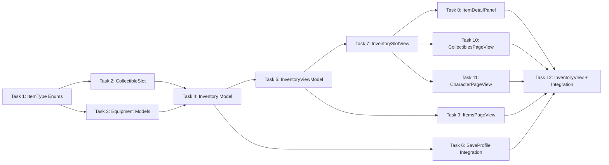

# Inventory System - Implementation Tasks

## Summary
- Total tasks: 12
- Estimated complexity: Medium-High
- **Status: COMPLETED**

## Task Dependency Graph

## Tasks

### Task 1: Create ItemType Enums
- **Status**: Completed
- **Dependencies**: None
- **Files**:
  - Create: `driftwood/Models/ItemType.swift`
- **Requirements Addressed**: FR-3, FR-4, FR-5, FR-7
- **Description**:
  Define all item type enumerations used throughout the inventory system.
- **Implementation Notes**:
  - All enums must be String, Codable, CaseIterable
  - GearType: sails, motor, pouch
  - ToolType: fishingRod, sword, axe, wand
  - ResourceType: wood, metalScrap, cloth, oil, commonFish, rareFish, rainbowFish
  - FoodIngredientType: apple, carrot, mushroom, herb
  - MealType: basicMeal, heartMeal, staminaMeal
  - ArmorSlotType: hat, shirt, pants, boots
  - AccessorySlotType: anklet, ring, chain, bracelet
  - ArmorSetType: old, mossy, magic, melee, movement
  - Add computed properties for display names, icons (SF Symbols), stackable flag
- **Acceptance Criteria**:
  - [ ] All enums compile and conform to Codable
  - [ ] Each type has displayName computed property
  - [ ] Each type has iconName computed property (SF Symbol)
  - [ ] ResourceType has isStackable property (true)
  - [ ] FoodIngredientType has isStackable property (false)

---

### Task 2: Create CollectibleSlot Model
- **Status**: Completed
- **Dependencies**: Task 1
- **Files**:
  - Create: `driftwood/Models/CollectibleSlot.swift`
- **Requirements Addressed**: FR-5, FR-6, FR-7, FR-13, FR-14
- **Description**:
  Model for individual inventory slots that can hold stackable or non-stackable items.
- **Implementation Notes**:
  - SlotContent enum with associated values:
    - .resource(type: ResourceType, quantity: Int)
    - .foodIngredient(type: FoodIngredientType)
    - .meal(type: MealType, healAmount: Int, tempHearts: Int)
    - .armor(piece: ArmorPiece)
    - .accessory(item: Accessory)
  - CollectibleSlot struct with:
    - id: UUID
    - content: SlotContent?
    - isFavorite: Bool = false
    - isJunk: Bool = false
    - addedAt: Date = Date()
  - Computed: isEmpty, canStack(with:), isMeal
- **Acceptance Criteria**:
  - [ ] SlotContent encodes/decodes correctly
  - [ ] Empty slot has content = nil
  - [ ] canStack returns true only for matching stackable resources
  - [ ] isMeal returns true only for meal content

---

### Task 3: Create Equipment Models
- **Status**: Completed
- **Dependencies**: Task 1
- **Files**:
  - Create: `driftwood/Models/Equipment.swift`
- **Requirements Addressed**: FR-8, FR-9, FR-10, FR-16
- **Description**:
  Models for armor pieces, accessories, and their stat bonuses.
- **Implementation Notes**:
  - ArmorStats struct: bonusHearts, fishingFortune, defense, magicRegen, movementSpeed
  - ArmorPiece struct: id, slot, setType, stats
  - Accessory struct: id, slot, tier (1-5)
  - Add static factory methods for creating armor by set type
  - Add computed stats for accessories based on tier
  - Reference player.md for exact stat values per set
- **Acceptance Criteria**:
  - [ ] ArmorPiece can be created for each slot/set combination
  - [ ] Old Set: +0.5 hearts, +5 fortune per piece
  - [ ] Mossy Set: +1 heart, +20 fortune per piece
  - [ ] Accessory stats scale with tier (1-5)

---

### Task 4: Create Inventory Model
- **Status**: Completed
- **Dependencies**: Task 2, Task 3
- **Files**:
  - Create: `driftwood/Models/Inventory.swift`
- **Requirements Addressed**: FR-3, FR-4, FR-5, FR-8, FR-9, FR-10, FR-15
- **Description**:
  Root container model holding all inventory data.
- **Implementation Notes**:
  - GearInventory: sailsTier (0-4), hasMotor, pouchTier (0-3)
  - ToolInventory: fishingRodTier (0-4), swordTier (0-3), axeTier (0-3), hasWand
  - EquipmentSlots: hat, shirt, pants, boots (all ArmorPiece?)
  - AccessorySlots: anklet, ring, chain, bracelet (all Accessory?)
  - MajorUpgrades: hasSailboat, hasFlippers, hasWings, hasPegasusBoots
  - Inventory struct combining all above + collectibles [CollectibleSlot] (30 items)
  - Inventory.empty() factory method
- **Acceptance Criteria**:
  - [ ] Inventory encodes/decodes without data loss
  - [ ] Inventory.empty() creates 30 empty collectible slots
  - [ ] All sub-structs have sensible defaults (tier 0, false, nil)

---

### Task 5: Create InventoryViewModel
- **Status**: Completed
- **Dependencies**: Task 4
- **Files**:
  - Create: `driftwood/ViewModels/InventoryViewModel.swift`
- **Requirements Addressed**: FR-7, FR-11, FR-12, FR-13, FR-14, FR-16, FR-17
- **Description**:
  ViewModel managing inventory operations and state.
- **Implementation Notes**:
  - @Published inventory: Inventory
  - @Published currentPage: InventoryPage (enum: items, collectibles, character)
  - @Published selectedSlotIndex: Int?
  - @Published sortMode: SortMode (enum: type, rarity, recent)
  - Methods:
    - addItem(_ content: SlotContent) -> Bool (handles stacking, returns false if full)
    - removeItem(at index: Int)
    - equipArmor(_ piece: ArmorPiece) (swaps with current if occupied)
    - equipAccessory(_ accessory: Accessory)
    - useMeal(at index: Int, player: inout Player)
    - toggleFavorite(at index: Int)
    - toggleJunk(at index: Int)
    - sortCollectibles(by mode: SortMode)
  - Stacking logic: find existing stack < 99, else find empty slot
  - Meal slots: indices 0-4 are meal-only
- **Acceptance Criteria**:
  - [ ] addItem stacks resources correctly up to 99
  - [ ] addItem returns false when inventory full
  - [ ] addItem prevents non-meals in slots 0-4
  - [ ] equipArmor swaps old armor to collectibles
  - [ ] useMeal removes meal and heals player
  - [ ] sortCollectibles reorders by selected mode
  - [ ] toggleFavorite/toggleJunk update slot flags

---

### Task 6: Integrate Inventory with SaveProfile
- **Status**: Completed
- **Dependencies**: Task 4
- **Files**:
  - Modify: `driftwood/Models/SaveProfile.swift`
- **Requirements Addressed**: FR-15
- **Description**:
  Add inventory property to SaveProfile for persistence.
- **Implementation Notes**:
  - Add `var inventory: Inventory` to SaveProfile
  - Update SaveProfile.empty(id:) to include Inventory.empty()
  - Update init(from player:, id:) - need to pass inventory separately or add to Player
  - Consider: inventory might need to be passed separately to SaveProfile init
- **Acceptance Criteria**:
  - [ ] SaveProfile includes inventory property
  - [ ] Empty profiles have empty inventory
  - [ ] Inventory persists across app launches
  - [ ] No regression in existing save/load functionality

---

### Task 7: Create InventorySlotView
- **Status**: Completed
- **Dependencies**: Task 5
- **Files**:
  - Create: `driftwood/Views/Inventory/InventorySlotView.swift`
- **Requirements Addressed**: FR-5, FR-11, FR-13, FR-14, NFR-2, NFR-3
- **Description**:
  Reusable view component for rendering a single inventory slot.
- **Implementation Notes**:
  - Props: slot: CollectibleSlot, isSelected: Bool, isMealSlot: Bool, onTap: () -> Void
  - 44x44 minimum size for touch targets
  - Background: gray when empty, colored when filled
  - Item icon centered (SF Symbol based on content type)
  - Stack count badge bottom-right (only if quantity > 1)
  - Favorite star top-left (yellow, only if isFavorite)
  - Junk indicator top-right (red X or trash, only if isJunk)
  - Selection highlight border
  - Meal slots have subtle fork/knife background indicator
- **Acceptance Criteria**:
  - [ ] Empty slot renders with placeholder background
  - [ ] Filled slot shows correct icon
  - [ ] Stack count displays for stacked items
  - [ ] Favorite star appears when isFavorite = true
  - [ ] Junk indicator appears when isJunk = true
  - [ ] Selected slot has visible highlight
  - [ ] Slot is tappable (44x44 touch target)

---

### Task 8: Create ItemDetailPanel
- **Status**: Completed
- **Dependencies**: Task 7
- **Files**:
  - Create: `driftwood/Views/Inventory/ItemDetailPanel.swift`
- **Requirements Addressed**: FR-11, FR-13, FR-14, FR-16, FR-17
- **Description**:
  Panel showing item details and action buttons when a slot is selected.
- **Implementation Notes**:
  - Props: content: SlotContent, isFavorite: Bool, isJunk: Bool, callbacks for actions
  - Layout:
    - Item icon (large) + name
    - Description text
    - Stats (if applicable)
    - Action buttons row: Use (meals), Equip (armor/accessories), Favorite, Junk, Drop
  - Conditionally show buttons based on content type
  - Close button or tap outside to dismiss
- **Acceptance Criteria**:
  - [ ] Panel displays item name and icon
  - [ ] Description text is readable
  - [ ] Use button appears for meals only
  - [ ] Equip button appears for armor/accessories only
  - [ ] Favorite/Junk buttons toggle state
  - [ ] Drop button available for all items
  - [ ] Close dismisses panel

---

### Task 9: Create ItemsPageView
- **Status**: Completed
- **Dependencies**: Task 5
- **Files**:
  - Create: `driftwood/Views/Inventory/ItemsPageView.swift`
- **Requirements Addressed**: FR-3, FR-4
- **Description**:
  Page 1 of inventory showing Gear and Tools with tier indicators.
- **Implementation Notes**:
  - Two sections: "Gear" and "Tools"
  - Gear row: Sails (0-4), Motor (owned/not), Pouch (0-3)
  - Tools row: Fishing Rod (0-4), Sword (0-3), Axe (0-3), Wand (owned/not)
  - Each item shows: icon, name, tier indicator (e.g., "Tier 2/4")
  - Unowned/tier-0 items shown grayed out
  - HStack layout for each section
- **Acceptance Criteria**:
  - [ ] Gear section shows 3 items
  - [ ] Tools section shows 4 items
  - [ ] Tier indicators display correctly
  - [ ] Unowned items are visually distinct (grayed)
  - [ ] Layout fits iPhone 16e landscape

---

### Task 10: Create CollectiblesPageView
- **Status**: Completed
- **Dependencies**: Task 7
- **Files**:
  - Create: `driftwood/Views/Inventory/CollectiblesPageView.swift`
- **Requirements Addressed**: FR-5, FR-6, FR-12
- **Description**:
  Page 2 of inventory with 5x6 grid for collectibles.
- **Implementation Notes**:
  - Sort button in top-right corner
  - LazyVGrid with 5 columns, 6 rows = 30 slots
  - Top row (indices 0-4) styled as meal slots
  - Bottom 25 slots (indices 5-29) for resources
  - Use InventorySlotView for each slot
  - Tap slot to select and show ItemDetailPanel
- **Acceptance Criteria**:
  - [ ] 5x6 grid renders correctly
  - [ ] Top 5 slots have meal indicator styling
  - [ ] Sort button opens sort mode picker
  - [ ] Tapping slot selects it
  - [ ] Selected slot shows ItemDetailPanel
  - [ ] Grid fits on screen without scrolling

---

### Task 11: Create CharacterPageView
- **Status**: Completed
- **Dependencies**: Task 7
- **Files**:
  - Create: `driftwood/Views/Inventory/CharacterPageView.swift`
- **Requirements Addressed**: FR-8, FR-9, FR-10
- **Description**:
  Page 3 of inventory showing equipment and major upgrades.
- **Implementation Notes**:
  - Three sections: Armor, Accessories, Major Upgrades
  - Armor: 4 labeled slots (Hat, Shirt, Pants, Boots) in 2x2 or horizontal
  - Accessories: 4 labeled slots (Anklet, Ring, Chain, Bracelet)
  - Major Upgrades: 4 icons showing owned/not (Sailboat, Flippers, Wings, Pegasus Boots)
  - Stats summary panel showing total bonuses from equipped gear
  - Tap equipment slot to select and show unequip option
- **Acceptance Criteria**:
  - [ ] 4 armor slots display with labels
  - [ ] 4 accessory slots display with labels
  - [ ] 4 major upgrade icons display
  - [ ] Owned upgrades highlighted, unowned grayed
  - [ ] Stats summary calculates totals correctly
  - [ ] Equipped items show item details

---

### Task 12: Create InventoryView and GameView Integration
- **Status**: Completed
- **Dependencies**: Task 6, Task 8, Task 9, Task 10, Task 11
- **Files**:
  - Create: `driftwood/Views/Inventory/InventoryView.swift`
  - Create: `driftwood/Views/Inventory/InventoryButton.swift`
  - Modify: `driftwood/Views/GameView.swift`
  - Modify: `driftwood/ViewModels/GameViewModel.swift`
- **Requirements Addressed**: FR-1, FR-2, NFR-1
- **Description**:
  Main inventory overlay, HUD button, and integration with game.
- **Implementation Notes**:
  - InventoryButton: backpack icon, positioned in controls area
  - InventoryView:
    - Full-screen overlay with semi-transparent black background
    - Page tabs at top (Items, Collectibles, Character)
    - Close button (X) top-right
    - Content area showing current page
    - ItemDetailPanel when slot selected
  - GameViewModel additions:
    - @Published var inventoryViewModel: InventoryViewModel
    - @Published var isInventoryOpen: Bool = false
    - openInventory() / closeInventory() methods
    - Pause game loop while inventory open
    - Update createSaveProfile() to include inventory
  - GameView additions:
    - Add InventoryButton to controlsLayer
    - Show InventoryView overlay when isInventoryOpen
- **Acceptance Criteria**:
  - [ ] Inventory button visible in game HUD
  - [ ] Tapping button opens inventory overlay
  - [ ] Page tabs switch between 3 pages
  - [ ] Close button dismisses inventory
  - [ ] Game loop pauses while inventory open
  - [ ] Inventory persists in save profile
  - [ ] Opening inventory is < 100ms (no lag)

---

## Implementation Order

1. **Task 1** - ItemType enums (foundation types)
2. **Task 2** - CollectibleSlot model (slot data)
3. **Task 3** - Equipment models (armor/accessories)
4. **Task 4** - Inventory model (combines all)
5. **Task 5** - InventoryViewModel (logic layer)
6. **Task 6** - SaveProfile integration (persistence)
7. **Task 7** - InventorySlotView (UI building block)
8. **Task 8** - ItemDetailPanel (slot actions)
9. **Task 9** - ItemsPageView (Page 1)
10. **Task 10** - CollectiblesPageView (Page 2)
11. **Task 11** - CharacterPageView (Page 3)
12. **Task 12** - InventoryView + Integration (wire it all up)

## Testing Notes

### Manual Testing Checklist
- [ ] Inventory button appears in game HUD
- [ ] Tapping button opens inventory overlay
- [ ] 3 page tabs are visible and functional
- [ ] Items page shows gear and tools with tiers
- [ ] Collectibles page shows 5x6 grid
- [ ] Top row of collectibles accepts only meals
- [ ] Character page shows armor/accessory slots
- [ ] Tapping slot shows detail panel
- [ ] Favorite toggle adds star to slot
- [ ] Junk toggle adds indicator to slot
- [ ] Sort button reorders collectibles
- [ ] Close button dismisses inventory
- [ ] Game pauses while inventory open
- [ ] Inventory persists after app restart

### Unit Test Cases
- Inventory encode/decode roundtrip
- addItem stacking to 99
- addItem to full inventory returns false
- Meal validation for slots 0-4
- Sort modes produce correct order
- Equipment stat calculations

## Integration Checklist
- [ ] All tasks completed
- [ ] App compiles without errors
- [ ] App runs on iPhone 16e simulator
- [ ] Manual testing checklist passed
- [ ] No console errors or warnings
- [ ] Inventory persists correctly

## Files Summary

### New Files (11)
- `driftwood/Models/ItemType.swift`
- `driftwood/Models/CollectibleSlot.swift`
- `driftwood/Models/Equipment.swift`
- `driftwood/Models/Inventory.swift`
- `driftwood/ViewModels/InventoryViewModel.swift`
- `driftwood/Views/Inventory/InventoryView.swift`
- `driftwood/Views/Inventory/InventoryButton.swift`
- `driftwood/Views/Inventory/InventorySlotView.swift`
- `driftwood/Views/Inventory/ItemDetailPanel.swift`
- `driftwood/Views/Inventory/ItemsPageView.swift`
- `driftwood/Views/Inventory/CollectiblesPageView.swift`
- `driftwood/Views/Inventory/CharacterPageView.swift`

### Modified Files (3)
- `driftwood/Models/SaveProfile.swift` - Add inventory property
- `driftwood/ViewModels/GameViewModel.swift` - Add InventoryViewModel, pause logic
- `driftwood/Views/GameView.swift` - Add InventoryButton, InventoryView overlay
