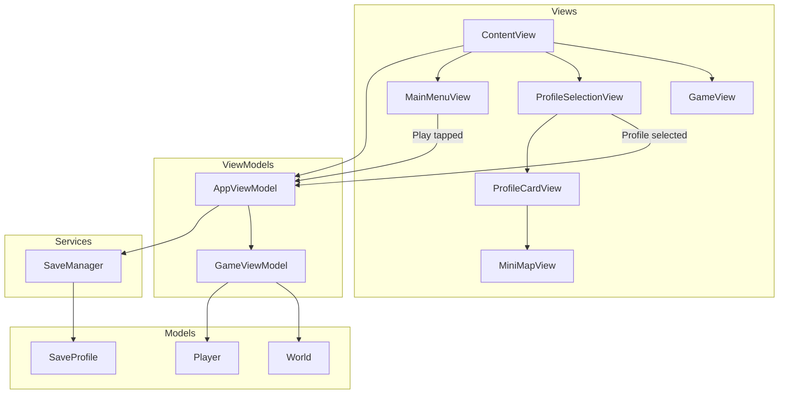
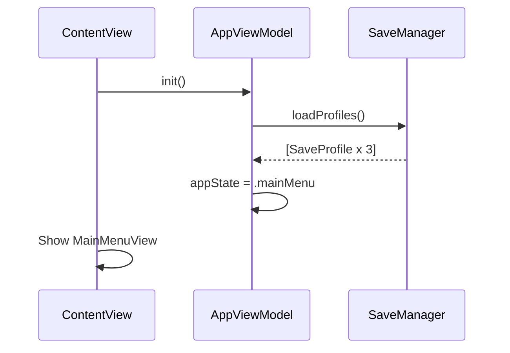
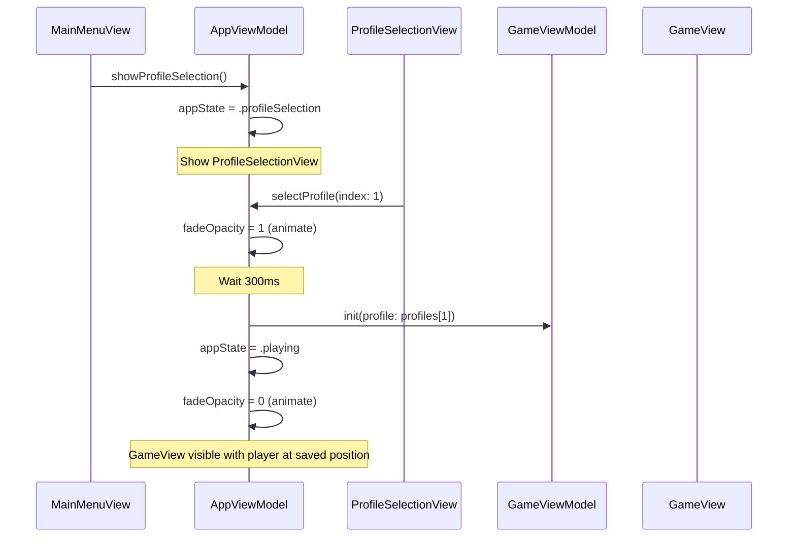
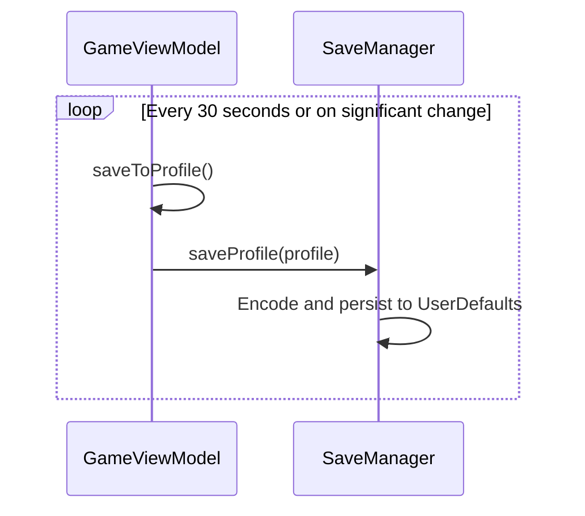

# Main Menu System - Design

## Overview

Implement a main menu flow with Play button, profile selection screen with 3 save slots, and fade transitions. The architecture follows MVVM with a new AppViewModel coordinating navigation state, a SaveManager for profile persistence, and menu views that display profile data with location previews.

## Tech Stack

- SwiftUI (existing)
- Combine (existing - for state observation)
- Foundation/UserDefaults (profile persistence)
- No external dependencies

## Architecture Diagram



## Component Design

### New Files

#### ViewModels/AppViewModel.swift
- **Type**: ViewModel (ObservableObject)
- **Purpose**: Manage app-level navigation state and screen transitions
- **Dependencies**: SwiftUI, SaveManager
- **Properties**:
  - `@Published appState: AppState` - Current screen (.mainMenu, .profileSelection, .playing)
  - `@Published fadeOpacity: Double` - For screen transitions
  - `@Published profiles: [SaveProfile]` - All 3 save profiles
  - `selectedProfileIndex: Int?` - Currently active profile slot
- **Key Methods**:
  - `showProfileSelection()` - Transition from main menu to profile cards
  - `selectProfile(index:)` - Handle profile selection with fade
  - `loadProfiles()` - Load all profiles from storage on init

#### Models/SaveProfile.swift
- **Type**: Model (Codable)
- **Purpose**: Store serializable player state for persistence
- **Dependencies**: Foundation
- **Properties**:
  - `id: Int` - Profile slot (0, 1, 2)
  - `position: CGPoint` - Last player position
  - `lookDirection: CGPoint` - Last facing direction
  - `health: Int` - Current hearts
  - `stamina: CGFloat` - Current stamina
  - `magic: CGFloat` - Current magic power
  - `isEmpty: Bool` - Whether this is a new game slot
  - `lastPlayed: Date?` - For display purposes
- **Key Methods**:
  - `static func empty(id:)` - Create default new game profile
  - `init(from player:, id:)` - Create profile from current player state

#### Services/SaveManager.swift
- **Type**: Service
- **Purpose**: Handle profile persistence to UserDefaults
- **Dependencies**: Foundation
- **Properties**:
  - `static let shared` - Singleton instance
  - `private let key = "driftwood.profiles"`
- **Key Methods**:
  - `loadProfiles() -> [SaveProfile]` - Load all 3 profiles
  - `saveProfile(_ profile: SaveProfile)` - Save single profile
  - `saveAllProfiles(_ profiles: [SaveProfile])` - Save all profiles

#### Views/MainMenuView.swift
- **Type**: View
- **Purpose**: Display title and Play button
- **Dependencies**: SwiftUI
- **Properties**:
  - `onPlayTapped: () -> Void` - Callback when Play pressed
- **Notes**: Centered layout, game title at top, Play button prominent

#### Views/ProfileSelectionView.swift
- **Type**: View
- **Purpose**: Display 3 profile cards horizontally
- **Dependencies**: SwiftUI, SaveProfile
- **Properties**:
  - `profiles: [SaveProfile]` - The 3 profiles to display
  - `onProfileSelected: (Int) -> Void` - Callback with profile index
- **Notes**: HStack with 3 ProfileCardViews, evenly spaced

#### Views/ProfileCardView.swift
- **Type**: View
- **Purpose**: Display single profile card with stats and preview
- **Dependencies**: SwiftUI, SaveProfile
- **Properties**:
  - `profile: SaveProfile` - Profile data to display
  - `slotNumber: Int` - Display as "Profile 1", "Profile 2", etc.
- **Subviews**:
  - MiniMapView for location preview
  - HeartsView (reused from GameView)
  - StaminaBarView (reused from GameView)
  - MagicBarView (new)

#### Views/MiniMapView.swift
- **Type**: View
- **Purpose**: Render small preview of world with player position
- **Dependencies**: SwiftUI, World
- **Properties**:
  - `playerPosition: CGPoint` - Where to show player marker
  - `world: World` - World to render (use shared/cached instance)
  - `size: CGFloat` - Total view size
- **Notes**: Simplified tile rendering at small scale, red dot for player

#### Views/MagicBarView.swift
- **Type**: View
- **Purpose**: Display magic power bar (similar to StaminaBarView)
- **Dependencies**: SwiftUI
- **Properties**:
  - `magic: CGFloat`
  - `maxMagic: CGFloat`
- **Notes**: Blue color to differentiate from green stamina bar

### Modified Files

#### ContentView.swift
- **Changes**:
  - Add `@StateObject var appViewModel = AppViewModel()`
  - Switch between MainMenuView, ProfileSelectionView, GameView based on appState
  - Add fade overlay for transitions
- **Reason**: ContentView becomes the navigation coordinator

#### Models/Player.swift
- **Changes**:
  - Add `var magic: CGFloat = 100`
  - Add `let maxMagic: CGFloat = 100`
  - Add initializer that accepts SaveProfile for state restoration
- **Reason**: FR-10 requires magic power tracking

#### ViewModels/GameViewModel.swift
- **Changes**:
  - Add `init(profile: SaveProfile)` to initialize from saved state
  - Add `func saveToProfile() -> SaveProfile` to export current state
  - Add `var currentProfileIndex: Int` to track which slot is active
  - Add auto-save on significant events (position change threshold, health change)
- **Reason**: Support profile loading and saving

#### Views/GameView.swift
- **Changes**:
  - Add MagicBarView to HUD
  - Accept optional initial profile for state restoration
- **Reason**: Display magic stat, support profile-based initialization

## Data Flow

### App Launch Flow


### Profile Selection Flow


### Auto-Save Flow


## Data Models

### AppState
```swift
enum AppState {
    case mainMenu
    case profileSelection
    case playing
}
```

### SaveProfile
```swift
struct SaveProfile: Codable, Identifiable {
    let id: Int // 0, 1, or 2
    var position: CodablePoint
    var lookDirection: CodablePoint
    var health: Int
    var stamina: CGFloat
    var magic: CGFloat
    var isEmpty: Bool
    var lastPlayed: Date?

    static func empty(id: Int) -> SaveProfile {
        let world = World()
        let tileSize: CGFloat = 24
        let centerX = CGFloat(world.width) * tileSize / 2
        let centerY = CGFloat(world.height) * tileSize / 2
        return SaveProfile(
            id: id,
            position: CodablePoint(x: centerX, y: centerY),
            lookDirection: CodablePoint(x: 1, y: 0),
            health: 5,
            stamina: 100,
            magic: 100,
            isEmpty: true,
            lastPlayed: nil
        )
    }
}

// CGPoint is not Codable, so use wrapper
struct CodablePoint: Codable {
    var x: CGFloat
    var y: CGFloat

    var cgPoint: CGPoint { CGPoint(x: x, y: y) }

    init(_ point: CGPoint) {
        self.x = point.x
        self.y = point.y
    }

    init(x: CGFloat, y: CGFloat) {
        self.x = x
        self.y = y
    }
}
```

## State Management

- `@StateObject var appViewModel: AppViewModel` in ContentView (owns navigation state)
- `@Published var appState: AppState` in AppViewModel (determines which view shows)
- `@Published var profiles: [SaveProfile]` in AppViewModel (profile data for cards)
- `@StateObject var gameViewModel: GameViewModel` created when entering game
- Fade transition managed by `@Published var fadeOpacity` in AppViewModel

## Error Handling

- **Corrupted profile data**: Catch decoding errors, reset to empty profile
- **Storage full**: Wrap save in do-catch, log error (no user-facing error for MVP)
- **Missing profiles on load**: Initialize empty profiles for missing slots
- **Rapid tap debounce**: Disable profile cards during transition animation

## Security Considerations

- No sensitive user data
- Profiles stored in UserDefaults (app sandbox)
- No network communication
- No authentication required

## Performance Considerations

- MiniMapView uses simplified rendering (1pt per tile vs 24pt)
- Profile loading happens once on app launch, cached in AppViewModel
- Auto-save uses throttling (30 second minimum interval)
- Fade animations use SwiftUI's built-in system (GPU accelerated)
- World instance shared between MiniMapView and GameView

## Accessibility

- Play button has clear text label
- Profile cards have accessibility labels describing slot and stats
- Hearts/stamina/magic bars have accessibility values
- Contrast: Card backgrounds should contrast with menu background
- Future: VoiceOver support for profile selection

## Testing Strategy

### Unit Tests
- SaveProfile encoding/decoding roundtrip
- SaveManager save and load
- Empty profile defaults are correct
- Profile initialization from Player state

### UI Tests
- Main menu displays on launch
- Play button navigates to profile selection
- 3 profile cards are displayed
- Tapping card triggers fade transition
- Game loads with correct player position from profile

## File Structure

```
driftwood/
├── Models/
│   ├── Player.swift (modified - add magic)
│   ├── SaveProfile.swift (new)
│   ├── Tile.swift
│   └── World.swift
├── ViewModels/
│   ├── AppViewModel.swift (new)
│   └── GameViewModel.swift (modified - profile support)
├── Views/
│   ├── GameView.swift (modified - magic bar)
│   ├── JoystickView.swift
│   ├── MainMenuView.swift (new)
│   ├── MagicBarView.swift (new)
│   ├── MiniMapView.swift (new)
│   ├── PlayerView.swift
│   ├── ProfileCardView.swift (new)
│   └── ProfileSelectionView.swift (new)
├── Services/
│   └── SaveManager.swift (new)
├── ContentView.swift (modified - navigation)
└── driftwoodApp.swift
```

## Requirements Coverage

| Requirement | Design Element |
|-------------|----------------|
| FR-1 Main Menu | MainMenuView |
| FR-2 Play Button | MainMenuView.onPlayTapped → AppViewModel.showProfileSelection() |
| FR-3 Profile Cards | ProfileSelectionView with 3 ProfileCardViews |
| FR-4 Stats Display | ProfileCardView using HeartsView, StaminaBarView, MagicBarView |
| FR-5 Location Preview | MiniMapView in ProfileCardView |
| FR-6 Empty Profile | SaveProfile.isEmpty, "New Game" display |
| FR-7 Profile Selection | ProfileCardView tap → AppViewModel.selectProfile() |
| FR-8 Fade Transition | AppViewModel.fadeOpacity with animation |
| FR-9 Position Restoration | GameViewModel.init(profile:) |
| FR-10 Save Profile Model | SaveProfile struct |
| FR-11 Profile Persistence | SaveManager with UserDefaults |
| FR-12 Profile Loading | AppViewModel.loadProfiles() on init |
