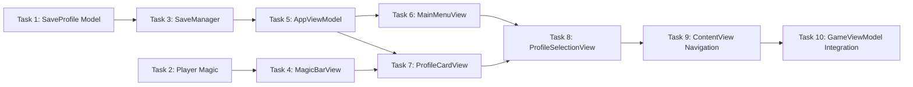

# Main Menu System - Implementation Tasks

## Summary
- Total tasks: 10
- Estimated complexity: Medium
- **Status: COMPLETED**

## Task Dependency Graph

## Tasks

### Task 1: Create SaveProfile Model
- **Status**: Completed
- **Dependencies**: None
- **Files**:
  - Create: `driftwood/Models/SaveProfile.swift`
- **Requirements Addressed**: FR-10
- **Implementation Notes**:
  - Created CodablePoint struct wrapping CGPoint
  - SaveProfile with id, position, lookDirection, health, stamina, magic, isEmpty, lastPlayed
  - Added static empty(id:) factory method
  - Conforms to Codable and Identifiable
  - Added init(from player:, id:) for creating profile from game state
- **Acceptance Criteria**:
  - [x] CodablePoint wraps CGPoint and is Codable
  - [x] SaveProfile contains all required properties
  - [x] SaveProfile.empty(id:) returns correct defaults
  - [x] Profile can encode/decode without data loss

---

### Task 2: Add Magic Property to Player
- **Status**: Completed
- **Dependencies**: None
- **Files**:
  - Modify: `driftwood/Models/Player.swift`
- **Requirements Addressed**: FR-10, FR-4
- **Implementation Notes**:
  - Added `var magic: CGFloat = 100`
  - Added `let maxMagic: CGFloat = 100`
- **Acceptance Criteria**:
  - [x] Player has magic and maxMagic properties
  - [x] Default magic is 100 (full bar)
  - [x] Existing code still compiles

---

### Task 3: Create SaveManager Service
- **Status**: Completed
- **Dependencies**: Task 1
- **Files**:
  - Create: `driftwood/Services/SaveManager.swift`
- **Requirements Addressed**: FR-11, FR-12, NFR-4
- **Implementation Notes**:
  - Singleton pattern with SaveManager.shared
  - Key: "driftwood.profiles"
  - loadProfiles() returns 3 profiles (creates empty if missing)
  - saveProfile() updates single profile
  - saveAllProfiles() saves entire array
  - Graceful error handling on decode failure
- **Acceptance Criteria**:
  - [x] SaveManager.shared is accessible
  - [x] loadProfiles() always returns exactly 3 profiles
  - [x] saveProfile() persists to UserDefaults
  - [x] Corrupted data resets to empty profile (no crash)

---

### Task 4: Create MagicBarView
- **Status**: Completed
- **Dependencies**: Task 2
- **Files**:
  - Create: `driftwood/Views/MagicBarView.swift`
- **Requirements Addressed**: FR-4
- **Implementation Notes**:
  - Same structure as StaminaBarView
  - Blue fill color
  - 100x12 dimensions
- **Acceptance Criteria**:
  - [x] MagicBarView renders blue bar
  - [x] Bar width scales with magic/maxMagic ratio
  - [x] Matches StaminaBarView dimensions

---

### Task 5: Create AppViewModel
- **Status**: Completed
- **Dependencies**: Task 3
- **Files**:
  - Create: `driftwood/ViewModels/AppViewModel.swift`
- **Requirements Addressed**: FR-1, FR-2, FR-7, FR-8, FR-12
- **Implementation Notes**:
  - AppState enum with .mainMenu, .profileSelection, .playing
  - @Published appState, fadeOpacity, profiles, isTransitioning
  - showProfileSelection(), backToMainMenu(), selectProfile(index:)
  - Profiles loaded on init via SaveManager
  - @MainActor for UI thread safety
  - Requires Combine import for @Published
- **Acceptance Criteria**:
  - [x] AppState enum has 3 cases
  - [x] Profiles load on init
  - [x] showProfileSelection() changes state
  - [x] selectProfile() performs fade animation
  - [x] Rapid taps are debounced via isTransitioning

---

### Task 6: Create MainMenuView
- **Status**: Completed
- **Dependencies**: Task 5
- **Files**:
  - Create: `driftwood/Views/MainMenuView.swift`
- **Requirements Addressed**: FR-1, FR-2
- **Implementation Notes**:
  - Centered VStack layout
  - "Driftwood Kingdom" title
  - Green "Play" button with rounded corners
  - Dark background
- **Acceptance Criteria**:
  - [x] Title text displays
  - [x] Play button is visible and tappable
  - [x] onPlayTapped callback fires on tap
  - [x] Layout is centered in landscape

---

### Task 7: Create ProfileCardView and MiniMapView
- **Status**: Completed
- **Dependencies**: Task 4, Task 5
- **Files**:
  - Create: `driftwood/Views/ProfileCardView.swift`
  - Create: `driftwood/Views/MiniMapView.swift`
- **Requirements Addressed**: FR-3, FR-4, FR-5, FR-6
- **Implementation Notes**:
  - MiniMapView renders world at scale with player dot
  - ProfileCardView shows slot name, mini-map, hearts, stamina, magic
  - Empty profiles show "New Game"
  - Reuses HeartsView, StaminaBarView, MagicBarView
- **Acceptance Criteria**:
  - [x] MiniMapView renders world tiles
  - [x] MiniMapView shows player position dot
  - [x] ProfileCardView shows slot number
  - [x] Empty profiles show "New Game" label
  - [x] Stats display correctly from profile data

---

### Task 8: Create ProfileSelectionView
- **Status**: Completed
- **Dependencies**: Task 6, Task 7
- **Files**:
  - Create: `driftwood/Views/ProfileSelectionView.swift`
- **Requirements Addressed**: FR-3, FR-7
- **Implementation Notes**:
  - HStack with 3 ProfileCardViews
  - "Select Profile" title
  - Back button to return to main menu
  - Each card tappable
- **Acceptance Criteria**:
  - [x] 3 cards display horizontally
  - [x] Cards are evenly spaced
  - [x] Tapping card triggers onProfileSelected
  - [x] Layout works on iPhone 16e landscape

---

### Task 9: Update ContentView for Navigation
- **Status**: Completed
- **Dependencies**: Task 8
- **Files**:
  - Modify: `driftwood/ContentView.swift`
- **Requirements Addressed**: FR-1, FR-2, FR-7, FR-8
- **Implementation Notes**:
  - Added @StateObject appViewModel
  - Switch statement for view routing
  - Fade overlay for transitions
  - GameView receives profile for initialization
- **Acceptance Criteria**:
  - [x] App launches to MainMenuView
  - [x] Play button shows ProfileSelectionView
  - [x] Selecting profile shows fade then GameView
  - [x] Fade overlay animates smoothly

---

### Task 10: Integrate GameViewModel with Profiles
- **Status**: Completed
- **Dependencies**: Task 9
- **Files**:
  - Modify: `driftwood/ViewModels/GameViewModel.swift`
  - Modify: `driftwood/Views/GameView.swift`
- **Requirements Addressed**: FR-9, FR-11, FR-4
- **Implementation Notes**:
  - GameViewModel.init(profile:) loads player state from SaveProfile
  - currentProfileIndex tracks active slot
  - createSaveProfile() exports current state
  - saveCurrentProfile() persists to SaveManager
  - Auto-save timer every 30 seconds
  - Saves on health change and game loop stop
  - GameView accepts profile in init
  - MagicBarView added to HUD
- **Acceptance Criteria**:
  - [x] GameViewModel can init from SaveProfile
  - [x] Player spawns at saved position
  - [x] Player stats match saved values
  - [x] Auto-save runs every 30 seconds
  - [x] MagicBarView shows in HUD
  - [x] Profile persists between app launches

---

## Implementation Order

1. **Task 1** - SaveProfile model (foundation) - DONE
2. **Task 2** - Player magic property (model extension) - DONE
3. **Task 3** - SaveManager service (persistence layer) - DONE
4. **Task 4** - MagicBarView (UI component) - DONE
5. **Task 5** - AppViewModel (navigation coordinator) - DONE
6. **Task 6** - MainMenuView (first screen) - DONE
7. **Task 7** - ProfileCardView + MiniMapView (card UI) - DONE
8. **Task 8** - ProfileSelectionView (card container) - DONE
9. **Task 9** - ContentView navigation (wire it up) - DONE
10. **Task 10** - GameViewModel integration (complete the loop) - DONE

## Testing Notes

### Manual Testing Checklist
- [ ] App launches to main menu (not game)
- [ ] "Play" button navigates to profile selection
- [ ] 3 profile cards are visible and spaced correctly
- [ ] Empty profiles show "New Game" with full stats
- [ ] Mini-map shows world preview with player dot
- [ ] Tapping profile card triggers fade to black
- [ ] Game loads with player at correct position
- [ ] Magic bar appears in game HUD
- [ ] After playing, quit and relaunch - profile shows updated stats
- [ ] Rapid tapping doesn't cause multiple transitions

## Integration Checklist
- [x] All tasks completed
- [x] App compiles without errors
- [ ] App runs on iPhone 16e simulator
- [ ] Manual testing checklist passed
- [ ] No console errors or warnings

## Files Created/Modified

### New Files (9)
- `driftwood/Models/SaveProfile.swift`
- `driftwood/Services/SaveManager.swift`
- `driftwood/ViewModels/AppViewModel.swift`
- `driftwood/Views/MainMenuView.swift`
- `driftwood/Views/ProfileSelectionView.swift`
- `driftwood/Views/ProfileCardView.swift`
- `driftwood/Views/MiniMapView.swift`
- `driftwood/Views/MagicBarView.swift`

### Modified Files (4)
- `driftwood/Models/Player.swift` - Added magic/maxMagic properties
- `driftwood/ViewModels/GameViewModel.swift` - Profile init, auto-save
- `driftwood/Views/GameView.swift` - Profile init, MagicBarView in HUD
- `driftwood/ContentView.swift` - Navigation with AppViewModel
