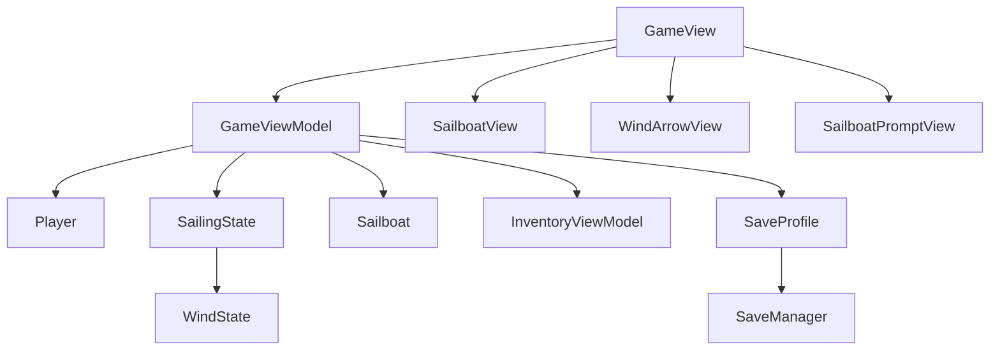
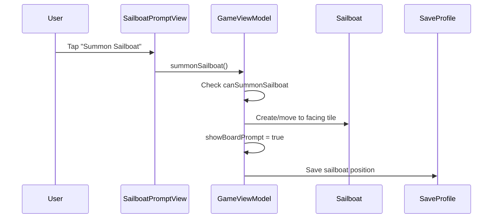
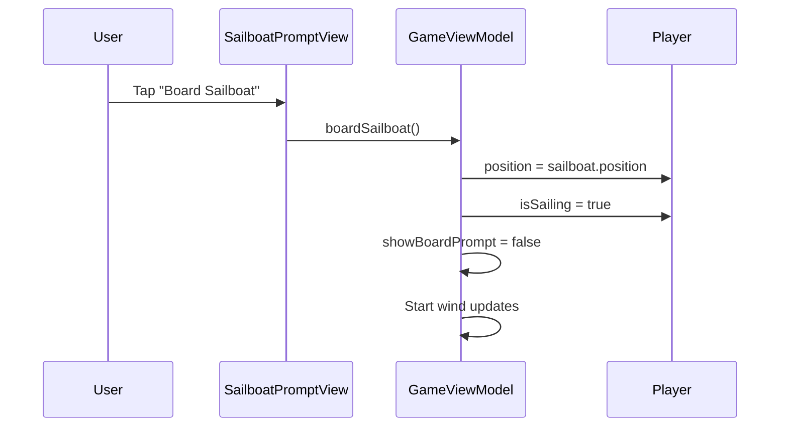
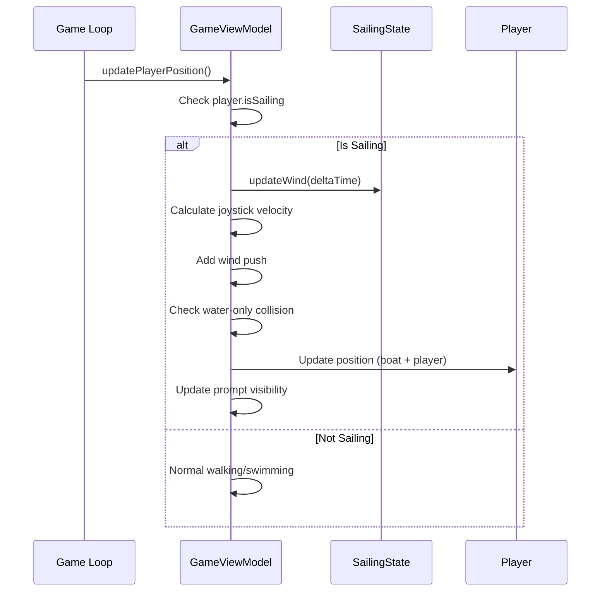
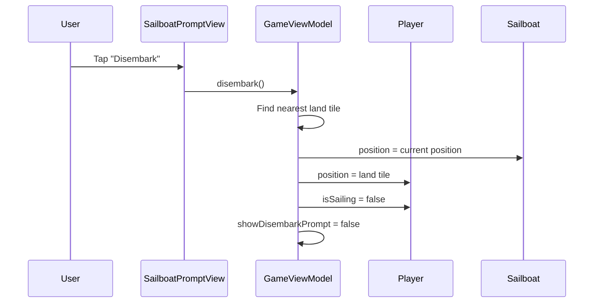

# Sailboat - Design

## Overview

The sailboat system adds ocean navigation to Driftwood Kingdom. Following existing MVVM patterns, we extend GameViewModel for sailing state, add a SailingState model for wind mechanics, and create new HUD views for wind display and contextual prompts. The sailboat is rendered as a world entity that the player can board, with movement handled by the existing game loop.

## Tech Stack

- SwiftUI (existing)
- Combine for timers (existing pattern from GameViewModel)
- No new dependencies

## Architecture Diagram



## Component Design

### New Files

#### Models/Sailboat.swift
- **Type**: Model
- **Purpose**: Represents the sailboat entity in the world
- **Dependencies**: None
- **Key Properties**:
  - `position: CGPoint` - world position of sailboat
  - `isInWorld: Bool` - whether sailboat has been placed
- **Key Methods**: None (data struct)

#### Models/SailingState.swift
- **Type**: Model
- **Purpose**: Tracks wind direction and sailing session state
- **Dependencies**: None
- **Key Properties**:
  - `windAngle: CGFloat` - current wind direction in radians (0 = right, increases counter-clockwise)
  - `windStrength: CGFloat` - constant gentle push strength
- **Key Methods**:
  - `windDirection: CGPoint` - unit vector of wind direction
  - `updateWind(deltaTime: CGFloat)` - drift wind angle randomly over time

#### Views/Sailing/SailboatView.swift
- **Type**: View
- **Purpose**: Renders the sailboat in the game world
- **Dependencies**: None
- **Key Features**:
  - Black rectangle placeholder (48x36, larger than 32x32 player)
  - Positioned in world coordinates
  - Later: proper sprite support

#### Views/Sailing/WindArrowView.swift
- **Type**: View
- **Purpose**: HUD element showing wind direction
- **Dependencies**: SailingState (wind angle)
- **Key Features**:
  - Arrow rotates based on wind angle
  - Only visible while sailing
  - Positioned in HUD layer

#### Views/Sailing/SailboatPromptView.swift
- **Type**: View
- **Purpose**: Contextual prompts for board/disembark/summon actions
- **Dependencies**: GameViewModel (for prompt state)
- **Key Features**:
  - Shows "Board Sailboat" when near boat
  - Shows "Disembark" when sailing near land
  - Shows "Summon Sailboat" when can summon
  - Tappable to trigger action

### Modified Files

#### Models/Player.swift
- **Changes**: Add `isSailing: Bool` property
- **Reason**: Track when player is on sailboat vs walking/swimming

#### Models/SaveProfile.swift
- **Changes**:
  - Add `sailboatPosition: CodablePoint?` (nil if not placed)
  - Add `isSailing: Bool` (default false)
- **Reason**: Persist sailboat world position and sailing state

#### Models/Inventory.swift
- **Changes**: None needed - `MajorUpgrades.hasSailboat` already exists
- **Reason**: Sailboat ownership already tracked

#### ViewModels/InventoryViewModel.swift
- **Changes**: Add `unlockMajorUpgrade(_ upgrade: MajorUpgradeType)` method if not exists
- **Reason**: Handle crafting result for sailboat

#### ViewModels/GameViewModel.swift
- **Changes**:
  - Add `@Published var sailboat: Sailboat?`
  - Add `@Published var sailingState: SailingState`
  - Add `@Published var showBoardPrompt: Bool`
  - Add `@Published var showDisembarkPrompt: Bool`
  - Add `@Published var showSummonPrompt: Bool`
  - Add `canSummonSailboat: Bool` computed property
  - Add `isNearSailboat: Bool` computed property
  - Add `isNearLand: Bool` computed property (while sailing)
  - Add `summonSailboat()` method
  - Add `boardSailboat()` method
  - Add `disembark()` method
  - Modify `updatePlayerPosition()` to handle sailing movement + wind
  - Modify `canMoveTo()` to use boat-specific collision when sailing
- **Reason**: Orchestrate sailing state and actions

#### Views/GameView.swift
- **Changes**:
  - Add SailboatView to world layer (when sailboat exists and player not sailing)
  - Add WindArrowView to HUD layer (when sailing)
  - Add SailboatPromptView to controls layer (contextual)
  - Conditionally render PlayerView vs boat when sailing
- **Reason**: Integrate sailing visuals and UI

## Data Flow

### Summon Sailboat Flow



### Board Sailboat Flow



### Sailing Movement Flow



### Disembark Flow



## Data Models

### Sailboat
```swift
struct Sailboat: Codable {
    var position: CGPoint

    init(position: CGPoint) {
        self.position = position
    }
}
```

### SailingState
```swift
struct SailingState {
    var windAngle: CGFloat = 0 // radians, 0 = right
    let windStrength: CGFloat = 15 // pixels per second push
    let windDriftRate: CGFloat = 0.3 // radians per second max drift

    var windDirection: CGPoint {
        CGPoint(x: cos(windAngle), y: sin(windAngle))
    }

    mutating func updateWind(deltaTime: CGFloat) {
        // random drift: -1 to 1 scaled by drift rate
        let drift = CGFloat.random(in: -1...1) * windDriftRate * deltaTime
        windAngle += drift
    }
}
```

### SaveProfile Extensions
```swift
// Add to SaveProfile
var sailboatPosition: CodablePoint?
var isSailing: Bool = false
```

## State Management

| State | Type | Location | Purpose |
|-------|------|----------|---------|
| `sailboat` | `Sailboat?` | GameViewModel | World sailboat entity (nil if not placed) |
| `sailingState` | `SailingState` | GameViewModel | Wind direction and strength |
| `player.isSailing` | `Bool` | Player | Whether player is on boat |
| `showBoardPrompt` | `Bool` | GameViewModel | Board prompt visibility |
| `showDisembarkPrompt` | `Bool` | GameViewModel | Disembark prompt visibility |
| `showSummonPrompt` | `Bool` | GameViewModel | Summon prompt visibility |
| `hasSailboat` | `Bool` | Inventory.majorUpgrades | Ownership status |
| `sailboatPosition` | `CodablePoint?` | SaveProfile | Persisted world position |

## Movement Constants

```swift
// In GameViewModel or Player
let sailingSpeedMultiplier: CGFloat = 4.0 // 4x swim speed
let baseSwimSpeed: CGFloat = 0.5 // 0.5x walk speed
// Effective sailing speed = movementSpeed * baseSwimSpeed * sailingSpeedMultiplier
//                        = 100 * 0.5 * 4 = 200 pixels/sec (2x walk speed)
```

## Collision Detection

When sailing, collision check changes:
- Walking: `!tile.isWalkable && !tile.isSwimmable` = blocked
- Sailing: `!tile.isSwimmable` = blocked (can only be on water)

```swift
private func canSailTo(_ position: CGPoint) -> Bool {
    // boat hitbox: 48 wide x 36 tall
    let halfWidth: CGFloat = 24
    let halfHeight: CGFloat = 18

    // check all tiles the boat overlaps
    let leftTile = Int(floor((position.x - halfWidth) / tileSize))
    let rightTile = Int(floor((position.x + halfWidth - 0.01) / tileSize))
    let topTile = Int(floor((position.y - halfHeight) / tileSize))
    let bottomTile = Int(floor((position.y + halfHeight - 0.01) / tileSize))

    for tileY in topTile...bottomTile {
        for tileX in leftTile...rightTile {
            if !world.tile(at: tileX, y: tileY).isSwimmable {
                return false
            }
        }
    }
    return true
}
```

## Prompt Logic

```swift
var canSummonSailboat: Bool {
    inventoryViewModel.inventory.majorUpgrades.hasSailboat &&
    !player.isSwimming &&
    !player.isSailing &&
    isFacingWater()
}

var isNearSailboat: Bool {
    guard let boat = sailboat, !player.isSailing else { return false }
    let distance = hypot(player.position.x - boat.position.x,
                         player.position.y - boat.position.y)
    return distance < tileSize * 1.5 // within ~1 tile
}

var isNearLandWhileSailing: Bool {
    guard player.isSailing else { return false }
    // check adjacent tiles for non-water
    let playerTileX = Int(player.position.x / tileSize)
    let playerTileY = Int(player.position.y / tileSize)
    for dy in -1...1 {
        for dx in -1...1 {
            let tile = world.tile(at: playerTileX + dx, y: playerTileY + dy)
            if tile.isWalkable { return true }
        }
    }
    return false
}
```

## Error Handling

- **Summon with no water nearby**: Button disabled (canSummonSailboat = false)
- **Disembark with no land nearby**: Button hidden (showDisembarkPrompt = false)
- **Save while sailing**: Save both sailboat position and player sailing state
- **Load while was sailing**: Restore player on sailboat at saved position

## Performance Considerations

- Wind update runs every frame (1/60s) - simple math, negligible cost
- Collision check for boat is same complexity as player
- Sailboat view is a single rectangle - trivial render cost
- Prompt visibility checks run every frame - simple distance calculations

## Accessibility

- Board/Disembark prompts use clear text labels
- Wind arrow uses distinct visual (arrow shape)
- Future: could add haptic feedback when wind changes significantly

## Testing Strategy

### Unit Tests
- `SailingState.updateWind()` changes angle within bounds
- `SailingState.windDirection` returns correct unit vector
- `canSummonSailboat` returns correct value for various states
- `isNearSailboat` correctly calculates distance threshold

### Integration Tests
- Crafting sailboat grants ownership
- Summoning places boat at correct position
- Boarding transitions player to sailing state
- Sailing movement applies wind correctly
- Disembarking places player on land
- Save/load preserves sailboat position and sailing state
