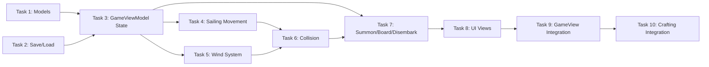

# Sailboat - Implementation Tasks

## Summary
- Total tasks: 10
- Estimated complexity: Medium

## Task Dependency Graph

## Tasks

### Task 1: Create Sailboat and SailingState Models
- **Status**: Completed
- **Completed**: 2026-02-06
- **Dependencies**: None
- **Files**:
  - Create: `driftwood/Models/Sailboat.swift`
  - Create: `driftwood/Models/SailingState.swift`
  - Modify: `driftwood/Models/Player.swift`
- **Requirements Addressed**: FR-17 (partial)
- **Implementation Notes**:
  - Created Sailboat struct with Codable conformance and CGPoint position
  - Created SailingState with windAngle, windStrength, windDriftRate, windDirection computed property, and updateWind method
  - Added isSailing and sailingSpeedMultiplier to Player
- **Acceptance Criteria**:
  - [x] Sailboat struct compiles with Codable conformance
  - [x] SailingState.windDirection returns correct unit vector for angle 0 (1, 0)
  - [x] SailingState.updateWind() modifies windAngle
  - [x] Player.isSailing property exists

### Task 2: Extend SaveProfile for Sailboat Persistence
- **Status**: Completed
- **Completed**: 2026-02-06
- **Dependencies**: Task 1
- **Files**:
  - Modify: `driftwood/Models/SaveProfile.swift`
- **Requirements Addressed**: FR-15, FR-16
- **Implementation Notes**:
  - Added sailboatPosition: CodablePoint? and isSailing: Bool to SaveProfile
  - Updated empty(), both init methods with default values for backwards compatibility
- **Acceptance Criteria**:
  - [x] SaveProfile includes sailboatPosition optional
  - [x] SaveProfile includes isSailing bool
  - [x] Existing saves load without crash (default values applied)

### Task 3: Add Sailboat State to GameViewModel
- **Status**: Completed
- **Completed**: 2026-02-06
- **Dependencies**: Task 1, Task 2
- **Files**:
  - Modify: `driftwood/ViewModels/GameViewModel.swift`
- **Requirements Addressed**: FR-3, FR-5, FR-12 (partial)
- **Implementation Notes**:
  - Added @Published sailboat and sailingState properties
  - Added canSummonSailboat, isNearSailboat, isNearLandWhileSailing computed properties
  - Load/save sailboat position from/to profile
- **Acceptance Criteria**:
  - [x] sailboat property published and optional
  - [x] sailingState initialized with defaults
  - [x] canSummonSailboat returns false when not owning sailboat
  - [x] isNearSailboat calculates distance correctly
  - [x] Sailboat position loads from and saves to profile

### Task 4: Implement Sailing Movement
- **Status**: Completed
- **Completed**: 2026-02-06
- **Dependencies**: Task 3
- **Files**:
  - Modify: `driftwood/ViewModels/GameViewModel.swift`
- **Requirements Addressed**: FR-7, NFR-1
- **Implementation Notes**:
  - Added updateSailingPosition method for sailing-specific movement
  - Sailing speed is 4x swim speed (2x walk speed)
  - No stamina drain while sailing
  - Sailboat position updates with player position
- **Acceptance Criteria**:
  - [x] Sailing moves at 2x walk speed (4x swim speed)
  - [x] No stamina consumed while sailing
  - [x] Sailboat position updates with player position
  - [x] Joystick controls work identically to walking

### Task 5: Implement Wind System
- **Status**: Completed
- **Completed**: 2026-02-06
- **Dependencies**: Task 3
- **Files**:
  - Modify: `driftwood/ViewModels/GameViewModel.swift`
- **Requirements Addressed**: FR-8, FR-9, FR-10
- **Implementation Notes**:
  - Wind updates every frame via sailingState.updateWind()
  - Wind push added to movement velocity
  - Combined velocity goes through collision check
- **Acceptance Criteria**:
  - [x] Wind angle changes over time while sailing
  - [x] Sailboat drifts in wind direction even without input
  - [x] Wind push combines with joystick movement
  - [x] Wind changes are smooth, not sudden

### Task 6: Implement Sailboat Collision Detection
- **Status**: Completed
- **Completed**: 2026-02-06
- **Dependencies**: Task 4, Task 5
- **Files**:
  - Modify: `driftwood/ViewModels/GameViewModel.swift`
- **Requirements Addressed**: FR-11
- **Implementation Notes**:
  - Added canSailTo() method for water-only collision
  - Boat hitbox: 48x36 (larger than player)
  - Slide movement implemented for coastline navigation
- **Acceptance Criteria**:
  - [x] Sailboat cannot move onto land tiles
  - [x] Sailboat stops at water edge
  - [x] Slide movement works along coastline
  - [x] Wind push blocked by land collision

### Task 7: Implement Summon, Board, and Disembark Actions
- **Status**: Completed
- **Completed**: 2026-02-06
- **Dependencies**: Task 3, Task 6
- **Files**:
  - Modify: `driftwood/ViewModels/GameViewModel.swift`
- **Requirements Addressed**: FR-4, FR-6, FR-13, FR-14
- **Implementation Notes**:
  - summonSailboat() places boat on facing water tile
  - boardSailboat() moves player to boat, sets isSailing
  - disembark() finds nearest land tile, keeps boat at water position
  - All actions trigger save
- **Acceptance Criteria**:
  - [x] Summon places boat on water tile player is facing
  - [x] Board moves player to boat position and sets sailing state
  - [x] Disembark finds land and moves player there
  - [x] Sailboat remains at water position after disembark
  - [x] All actions trigger save

### Task 8: Create Sailing UI Views
- **Status**: Completed
- **Completed**: 2026-02-06
- **Dependencies**: Task 3
- **Files**:
  - Create: `driftwood/Views/Sailing/SailboatView.swift`
  - Create: `driftwood/Views/Sailing/WindArrowView.swift`
  - Create: `driftwood/Views/Sailing/SailboatPromptView.swift`
- **Requirements Addressed**: FR-5, FR-8, FR-12, FR-17, NFR-2, NFR-3
- **Implementation Notes**:
  - SailboatView: Black rectangle 48x36 placeholder
  - WindArrowView: Rotating arrow with wind angle, "Wind" label
  - SailboatPromptView: Tappable button with icon and text for summon/board/disembark
- **Acceptance Criteria**:
  - [x] SailboatView renders black rectangle at correct world position
  - [x] WindArrowView rotates based on wind angle
  - [x] SailboatPromptView shows correct text for each state
  - [x] Prompts are tappable and trigger actions
  - [x] All views follow existing style patterns

### Task 9: Integrate Sailing into GameView
- **Status**: Completed
- **Completed**: 2026-02-06
- **Dependencies**: Task 7, Task 8
- **Files**:
  - Modify: `driftwood/Views/GameView.swift`
- **Requirements Addressed**: FR-6, FR-8, FR-17
- **Implementation Notes**:
  - SailboatView added to world layer (shows when not sailing)
  - When sailing, SailboatView replaces PlayerView at center
  - WindArrowView added to HUD (only when sailing)
  - SailboatPromptView shows contextual prompts
  - Tool and sprint buttons hidden while sailing
- **Acceptance Criteria**:
  - [x] Sailboat visible in world when summoned
  - [x] Player sprite hidden, boat shown when sailing
  - [x] Wind arrow appears in HUD when sailing
  - [x] Correct prompt shows based on game state
  - [x] Camera follows boat/player correctly

### Task 10: Wire Up Crafting to Grant Sailboat
- **Status**: Completed
- **Completed**: 2026-02-06
- **Dependencies**: Task 9
- **Files**:
  - Modify: `driftwood/ViewModels/InventoryViewModel.swift` (no changes needed)
- **Requirements Addressed**: FR-1, FR-2
- **Implementation Notes**:
  - Existing craft() method already handles .majorUpgrade case
  - Recipe already exists in Recipe.swift
  - CharacterPageView already displays major upgrades
- **Acceptance Criteria**:
  - [x] Crafting sailboat recipe grants hasSailboat = true
  - [x] Sailboat appears in Character page Major Upgrades section
  - [x] Can summon sailboat after crafting

## Implementation Order

1. **Task 1** - Create Sailboat and SailingState models ✓
2. **Task 2** - Extend SaveProfile for persistence ✓
3. **Task 3** - Add sailboat state to GameViewModel ✓
4. **Task 4** - Implement sailing movement ✓
5. **Task 5** - Implement wind system ✓
6. **Task 6** - Implement sailboat collision ✓
7. **Task 7** - Implement summon/board/disembark ✓
8. **Task 8** - Create sailing UI views ✓
9. **Task 9** - Integrate into GameView ✓
10. **Task 10** - Wire up crafting ✓

## Testing Tasks

### Test Task 1: Manual Testing Checklist
- **Dependencies**: All tasks complete
- **Test Cases**:
  - Craft sailboat with correct materials
  - Verify sailboat appears in Character page
  - Summon sailboat when facing water
  - Board sailboat via prompt
  - Move sailboat with joystick
  - Observe wind arrow rotation
  - Observe boat drift from wind
  - Sail into land (should stop)
  - Disembark onto land
  - Verify sailboat stays in water
  - Save game while sailing
  - Load game and verify sailing state restored
  - Save game while not sailing
  - Load game and verify sailboat position restored

## Integration Checklist
- [x] All tasks completed
- [ ] Manual testing passed
- [x] No crashes during normal gameplay (build succeeded)
- [ ] Save/load works correctly
- [ ] Performance acceptable (60fps maintained)
