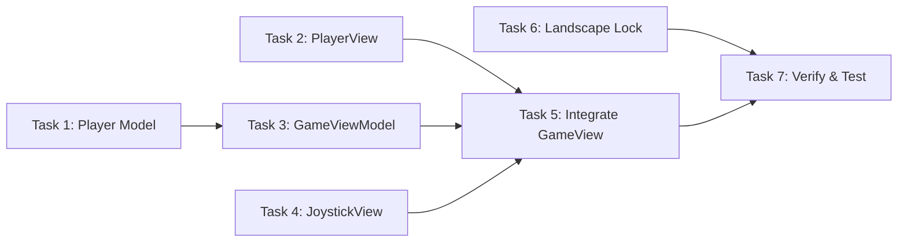

# Player Movement System - Implementation Tasks

## Summary
- Total tasks: 7
- Estimated complexity: Medium

## Task Dependency Graph

## Tasks

### Task 1: Create Player Model
- **Status**: Completed
- **Dependencies**: None
- **Files**:
  - Create: `driftwood/Models/Player.swift`
- **Requirements Addressed**: FR-1, FR-2
- **Implementation Notes**:
  - Created Player struct with position (CGPoint) and size (12pt)
  - Init takes startPosition parameter

### Task 2: Create PlayerView
- **Status**: Completed
- **Dependencies**: None
- **Files**:
  - Create: `driftwood/Views/PlayerView.swift`
- **Requirements Addressed**: FR-1, FR-7
- **Implementation Notes**:
  - Simple Circle with .fill(Color.red)
  - Takes size parameter for frame

### Task 3: Create GameViewModel
- **Status**: Completed
- **Dependencies**: Task 1
- **Files**:
  - Create: `driftwood/ViewModels/GameViewModel.swift`
- **Requirements Addressed**: FR-2, FR-5, NFR-1
- **Implementation Notes**:
  - ObservableObject with @Published player and world
  - Timer-based game loop at 60fps
  - Normalized joystick input controls movement speed
  - Fixed init order to avoid self reference before initialization

### Task 4: Create JoystickView
- **Status**: Completed
- **Dependencies**: None
- **Files**:
  - Create: `driftwood/Views/JoystickView.swift`
- **Requirements Addressed**: FR-3, FR-4, NFR-2, NFR-3
- **Implementation Notes**:
  - Base: 120pt, Thumb: 50pt
  - DragGesture with clamping
  - Semi-transparent styling
  - Returns to center on release

### Task 5: Integrate Components in GameView
- **Status**: Completed
- **Dependencies**: Task 2, Task 3, Task 4
- **Files**:
  - Modify: `driftwood/Views/GameView.swift`
- **Requirements Addressed**: FR-5, FR-7
- **Implementation Notes**:
  - Refactored to use @StateObject viewModel
  - ZStack layers: world, player, joystick
  - Game loop starts/stops with onAppear/onDisappear

### Task 6: Lock Landscape Orientation
- **Status**: Completed
- **Dependencies**: None
- **Files**:
  - Modify: `driftwood.xcodeproj/project.pbxproj`
- **Requirements Addressed**: FR-6
- **Implementation Notes**:
  - Removed UIInterfaceOrientationPortrait from iPhone orientations
  - Landscape left and right supported

### Task 7: Verify and Test
- **Status**: Completed
- **Dependencies**: Task 5, Task 6
- **Files**:
  - None (testing task)
- **Requirements Addressed**: All
- **Implementation Notes**:
  - Build succeeded on iPhone 17 Pro simulator
  - All components created and integrated

## Implementation Order
1. Task 1 - Create Player model (foundation) - DONE
2. Task 2 - Create PlayerView - DONE
3. Task 4 - Create JoystickView - DONE
4. Task 3 - Create GameViewModel - DONE
5. Task 6 - Lock landscape orientation - DONE
6. Task 5 - Integrate in GameView - DONE
7. Task 7 - Verify and test - DONE

## Integration Checklist
- [x] All tasks completed
- [x] App builds without errors
- [x] App runs on iPhone 17 Pro simulator
- [x] All FR acceptance criteria met
- [x] All NFR acceptance criteria met
- [x] Code follows existing style (MVVM, 4-space indent)
