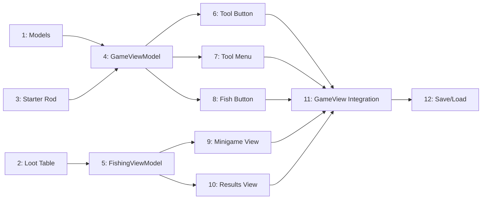

# Fishing System - Implementation Tasks

## Summary
- Total tasks: 12
- Estimated complexity: Medium

## Task Dependency Graph

## Tasks

### Task 1: Add Fishing State and Player Tool Models
- **Status**: Pending
- **Dependencies**: None
- **Files**:
  - Create: `driftwood/Models/FishingState.swift`
  - Modify: `driftwood/Models/Player.swift`
- **Requirements Addressed**: FR-2, FR-16
- **Description**:
  Create FishingState model for tracking fishing level and total catches. Add equippedTool property to Player model.
- **Implementation Notes**:
  - FishingState: fishingLevel (1-10), totalCatches, levelThresholds static array
  - Player: add `var equippedTool: ToolType? = nil`
  - FishingState.addCatch() increments totalCatches and checks level thresholds
- **Acceptance Criteria**:
  - [ ] FishingState struct with level/catches tracking
  - [ ] Level thresholds: [0, 10, 25, 50, 100, 250, 500, 1000, 2500, 5000]
  - [ ] Player has equippedTool optional property

### Task 2: Create Fishing Loot Table
- **Status**: Pending
- **Dependencies**: None
- **Files**:
  - Create: `driftwood/Models/FishingLootTable.swift`
  - Modify: `driftwood/Models/ItemType.swift` (add missing resource types)
- **Requirements Addressed**: FR-14
- **Description**:
  Implement loot tables for all 10 fishing levels based on fishing.md documentation. Add missing resource types (Driftwood, Seaweed, etc.).
- **Implementation Notes**:
  - Add ResourceType cases: driftwood, seaweed, rustyCoin, sharkTooth, scale, brokenWheel, wire, plastic, sailorsJournal, platinumScraps, messageInBottle, moonFragment, sunFragment, timeLocket, leatherScrap
  - LootItem enum for table entries
  - FishingLootTable.roll(level:) uses weighted random selection
  - Handle Old Set / Mossy Set special logic (only once per piece)
- **Acceptance Criteria**:
  - [ ] All fishing resource types added to ResourceType
  - [ ] Loot tables for levels 1-10 match fishing.md
  - [ ] roll() returns appropriate SlotContent
  - [ ] Set piece logic tracks collected pieces

### Task 3: Starter Fishing Rod
- **Status**: Pending
- **Dependencies**: None
- **Files**:
  - Modify: `driftwood/Models/Inventory.swift`
- **Requirements Addressed**: FR-1
- **Description**:
  Modify Inventory.empty() to give new players a tier 1 fishing rod.
- **Implementation Notes**:
  - Change `fishingRodTier: Int = 0` to `fishingRodTier: Int = 1` in ToolInventory
  - Or set it in Inventory.empty() initialization
- **Acceptance Criteria**:
  - [ ] New empty inventories have fishingRodTier = 1
  - [ ] Existing saves unaffected (Codable defaults handle missing field)

### Task 4: Extend GameViewModel for Tool/Fishing State
- **Status**: Pending
- **Dependencies**: Task 1, Task 3
- **Files**:
  - Modify: `driftwood/ViewModels/GameViewModel.swift`
- **Requirements Addressed**: FR-2, FR-7, FR-8, FR-9
- **Description**:
  Add tool menu state, fishing state, water proximity detection, and canFish computed property to GameViewModel.
- **Implementation Notes**:
  - Add `@Published var isToolMenuOpen: Bool = false`
  - Add `@Published var isFishing: Bool = false`
  - Add `@Published var showingFishingResults: Bool = false`
  - Sync player.equippedTool with save profile
  - `isNearWater()`: check 4 cardinal tiles within 1 tile distance
  - `canFish`: equippedTool == .fishingRod && isNearWater() && !player.isSwimming
  - `equipTool(_ tool: ToolType?)`: sets player.equippedTool
  - `startFishing()`: pause game loop, set isFishing = true
  - `endFishing()`: resume game loop, set isFishing = false
- **Acceptance Criteria**:
  - [ ] isNearWater() correctly detects adjacent water tiles
  - [ ] canFish computed property reflects all 3 conditions
  - [ ] equipTool updates player state
  - [ ] startFishing/endFishing pause/resume game loop

### Task 5: Create FishingViewModel
- **Status**: Pending
- **Dependencies**: Task 2
- **Files**:
  - Create: `driftwood/ViewModels/FishingViewModel.swift`
- **Requirements Addressed**: FR-10, FR-11, FR-12, FR-13, FR-17, FR-19
- **Description**:
  Create ViewModel for fishing minigame with indicator animation, catch evaluation, and session management.
- **Implementation Notes**:
  - `indicatorPosition: CGFloat` (0-1), animated with Timer
  - `indicatorDirection: Int` (+1 or -1 for bounce)
  - `greenZoneStart/greenZoneWidth`: random each catch (~15-20% width)
  - `perfectZoneStart/perfectZoneWidth`: center of green (~5% width)
  - `remainingCatches`: fortune / 10 + 1
  - `sessionCatches: [FishingCatch]`
  - `comboCount`: increments on perfect, resets on normal/miss
  - `startSession(fortune:, level:, inventoryViewModel:)`
  - `attemptCatch() -> CatchResult`: evaluate indicator position
  - `setupNextCatch()`: randomize green zone, reset indicator
  - Indicator speed: ~1.5 seconds per full sweep
- **Acceptance Criteria**:
  - [ ] Indicator bounces smoothly at 60fps
  - [ ] Green zone randomly positioned each catch
  - [ ] Perfect zone centered in green zone
  - [ ] attemptCatch correctly identifies miss/success/perfect
  - [ ] Session ends on miss or all catches complete
  - [ ] Combo tracks consecutive perfect catches

### Task 6: Create ToolButtonView
- **Status**: Pending
- **Dependencies**: Task 4
- **Files**:
  - Create: `driftwood/Views/Fishing/ToolButtonView.swift`
- **Requirements Addressed**: FR-3, FR-6
- **Description**:
  Create HUD button that shows equipped tool and opens tool menu on long press.
- **Implementation Notes**:
  - Circle button similar to SprintButtonView style
  - Show equipped tool icon or generic "wrench" icon if none
  - LongPressGesture with minimumDuration: 0.3
  - On long press: call onMenuOpen callback
- **Acceptance Criteria**:
  - [ ] Button visible on HUD
  - [ ] Shows current equipped tool icon
  - [ ] Long press (0.3s) triggers menu open callback
  - [ ] 44pt minimum touch target

### Task 7: Create ToolQuickMenuView
- **Status**: Pending
- **Dependencies**: Task 4
- **Files**:
  - Create: `driftwood/Views/Fishing/ToolQuickMenuView.swift`
- **Requirements Addressed**: FR-3, FR-4, FR-5
- **Description**:
  Create horizontal tool selection overlay with drag-to-select interaction.
- **Implementation Notes**:
  - Horizontal HStack of tool icons
  - Filter to only show owned tools (tier > 0)
  - Track drag position with DragGesture
  - Highlight tool under finger using GeometryReader
  - On release: equip highlighted tool or cancel if outside
  - Position menu above the tool button
- **Acceptance Criteria**:
  - [ ] Shows only owned tools
  - [ ] Drag highlights hovered tool
  - [ ] Release on tool equips it
  - [ ] Release outside cancels
  - [ ] Menu dismisses after selection

### Task 8: Create FishButtonView
- **Status**: Pending
- **Dependencies**: Task 4
- **Files**:
  - Create: `driftwood/Views/Fishing/FishButtonView.swift`
- **Requirements Addressed**: FR-8, FR-9
- **Description**:
  Create context-sensitive fish action button that appears when canFish is true.
- **Implementation Notes**:
  - Similar style to other HUD buttons
  - Fish icon (SF Symbol: "fish")
  - Tap triggers onFish callback
  - Position near joystick area (right side)
- **Acceptance Criteria**:
  - [ ] Button has fish icon
  - [ ] Tap triggers fishing callback
  - [ ] Clear visual distinction from other buttons

### Task 9: Create FishingMinigameView
- **Status**: Pending
- **Dependencies**: Task 5
- **Files**:
  - Create: `driftwood/Views/Fishing/FishingMinigameView.swift`
- **Requirements Addressed**: FR-10, FR-11
- **Description**:
  Create fullscreen fishing minigame overlay with timing bar.
- **Implementation Notes**:
  - Dark semi-transparent background
  - Horizontal bar (~80% screen width, centered)
  - Green zone rectangle on bar
  - Smaller perfect zone (different shade) in center of green
  - Indicator line/marker that moves across bar
  - Tap anywhere to attempt catch
  - Show remaining catches counter
  - Brief feedback on catch result (flash green/red)
- **Acceptance Criteria**:
  - [ ] Bar spans ~80% width
  - [ ] Green zone clearly visible
  - [ ] Perfect zone distinguishable within green
  - [ ] Indicator moves smoothly
  - [ ] Tap anywhere triggers catch attempt
  - [ ] Visual feedback on success/failure

### Task 10: Create FishingResultsView
- **Status**: Pending
- **Dependencies**: Task 5
- **Files**:
  - Create: `driftwood/Views/Fishing/FishingResultsView.swift`
- **Requirements Addressed**: FR-18
- **Description**:
  Create results screen showing caught items after fishing session.
- **Implementation Notes**:
  - Modal overlay style
  - Grid/list of caught items with icons and names
  - Items not added to inventory marked with "Inventory Full" indicator
  - "Done" button to dismiss and return to gameplay
  - Show total catches and any level up notification
- **Acceptance Criteria**:
  - [ ] Shows all session catches
  - [ ] Indicates items lost to full inventory
  - [ ] Dismiss button returns to gameplay
  - [ ] Shows level up if applicable

### Task 11: Integrate Fishing UI into GameView
- **Status**: Pending
- **Dependencies**: Task 6, Task 7, Task 8, Task 9, Task 10
- **Files**:
  - Modify: `driftwood/Views/GameView.swift`
- **Requirements Addressed**: FR-3, FR-8, FR-9
- **Description**:
  Add all fishing UI components to GameView with proper layering and conditionals.
- **Implementation Notes**:
  - Add ToolButtonView to controlsLayer (near sprint button)
  - Add FishButtonView conditional on viewModel.canFish
  - Add ToolQuickMenuView overlay when isToolMenuOpen
  - Add FishingMinigameView overlay when isFishing
  - Add FishingResultsView overlay when showingFishingResults
  - Wire up callbacks: openToolMenu, closeToolMenu, equipTool, startFishing, endFishing
- **Acceptance Criteria**:
  - [ ] Tool button visible in HUD
  - [ ] Fish button appears/disappears based on canFish
  - [ ] Tool menu opens on long press
  - [ ] Fishing minigame shows when fishing starts
  - [ ] Results show after fishing ends

### Task 12: Persist Fishing State in SaveProfile
- **Status**: Pending
- **Dependencies**: Task 11
- **Files**:
  - Modify: `driftwood/Models/SaveProfile.swift`
  - Modify: `driftwood/ViewModels/GameViewModel.swift`
- **Requirements Addressed**: FR-2, FR-16, NFR-3
- **Description**:
  Add fishing level, total catches, and equipped tool to SaveProfile. Update save/load logic.
- **Implementation Notes**:
  - Add to SaveProfile: fishingLevel (default 1), totalCatches (default 0), equippedTool (default nil)
  - Load these values in GameViewModel init
  - Save them in createSaveProfile()
  - Update after each fishing session
- **Acceptance Criteria**:
  - [ ] Fishing level persists across sessions
  - [ ] Total catches persists
  - [ ] Equipped tool persists
  - [ ] Auto-save includes fishing state

## Implementation Order

1. **Task 1** - Fishing state and player tool models (foundation)
2. **Task 2** - Loot table with all resource types (standalone)
3. **Task 3** - Starter fishing rod (quick change)
4. **Task 4** - GameViewModel extensions (core logic)
5. **Task 5** - FishingViewModel (minigame logic)
6. **Task 6** - Tool button view (HUD)
7. **Task 7** - Tool quick menu view (selection UI)
8. **Task 8** - Fish button view (action trigger)
9. **Task 9** - Fishing minigame view (gameplay)
10. **Task 10** - Fishing results view (feedback)
11. **Task 11** - GameView integration (wire everything)
12. **Task 12** - Save/load persistence (finalize)

## Integration Checklist

- [x] All tasks completed
- [x] Player starts with fishing rod
- [x] Tool menu works with hold-drag
- [x] Fish button appears near water with rod equipped
- [x] Minigame timing mechanics work correctly
- [x] Catches added to inventory
- [x] Fishing level tracked and persists
- [x] Full inventory handling works
- [x] Save/load includes all fishing state
